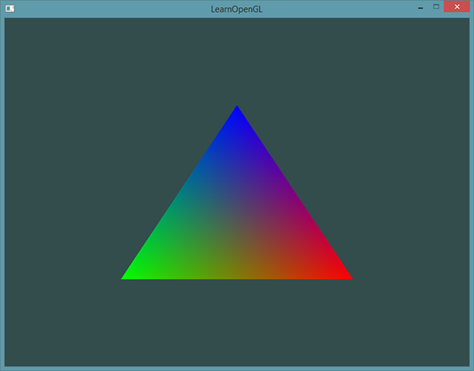
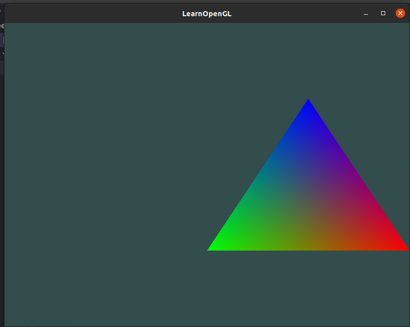

Hello opengl`


### 往期文章链接汇总

[github源码仓库](https://github.com/zzu-andrew/opengl_tutorial)

[opengl环境准备](https://wangyazhou.blog.csdn.net/article/details/112717440)

[opengl编程从入门到精通-hello,window](https://wangyazhou.blog.csdn.net/article/details/112723441)

[OpenGL从入门到精通--你好三角形](https://wangyazhou.blog.csdn.net/article/details/112734898)

[OpenGL从入门到精通--着色器的使用](https://wangyazhou.blog.csdn.net/article/details/112760229)

[](https://wangyazhou.blog.csdn.net/article/details/113073323)


### 前置知识

1. 全文使用`C++`实现，要有一定的`C++`基础，但你并不非得是一个`C++`专家
2. 线性代数
3. 几何
4. 三角学

在开始这段旅程之前我们先了解一下`OpenGL`到底是什么。一般它被认为是一个`API`(`Application Programming Interface,` 应用程序编程接口)，包含了一系列可以操作图形、图像的函数。然而，`OpenGL`本身并不是一个`API`，它仅仅是一个由`[Khronos`组织](http://www.khronos.org/)制定并维护的规范(`Specification`)。

### 安装`OpenGL`

网上教程有很多，这个自行百度，我这里是在`Linux`上进行的，只需要使用

```bash
sudo apt-get install build-essential libgl1-mesa-dev
sudo apt-get install freeglut3-dev
sudo apt-get install libglew-dev libsdl2-dev libsdl2-image-dev libglm-dev libfreetype6-dev
```

### 构建`GLFW`

地址：

[GLDW]: https://www.glfw.org/download.html	"opengl-glfw"


### 用`GLAD`简化`OpenGL`


使用`GLAD`简化`OpenGL`，这里我已经构建好了，要是想省事就直接下载就行了

链接: https://pan.baidu.com/s/1TmtM7O8J4aTnfP6elIgs7g  密码: g5go


### 窗口

>  请确认是在包含`GLFW`的头文件之前包含了`GLAD`的头文件。`GLAD`的头文件包含了正确的`OpenGL`头文件（例如`GL/gl.h`），所以需要在其它依赖于`OpenGL`的头文件之前包含GLAD。

1. 进行任何事之前先初始化`glfw`

初始化函数`glfwInit`

```cpp
// 对glfw进行初始化
glfwInit();
```

2. 版本的命中和版本信息的获取(非必须)

```cpp
// 打印出glfw的版本信息
//    int* major, int* minor, int* rev
int major, minor, rev;
glfwGetVersion(&major, &minor, &rev);
cout << "major = " << major << " minor = " << minor << " rev = " << rev << endl;
glfwWindowHint(GLFW_CONTEXT_VERSION_MAJOR, 3);
glfwWindowHint(GLFW_CONTEXT_VERSION_MINOR, 3);
glfwWindowHint(GLFW_OPENGL_PROFILE, GLFW_OPENGL_CORE_PROFILE);
```

3. 创建窗口

```cpp
// glfw window creation
// glfw创建窗口
GLFWwindow* window = glfwCreateWindow(SCR_WIDTH, SCR_HEIGHT, "LearnOpenGL", nullptr, nullptr);
if (window == nullptr)
{
    std::cout << "Failed to create GLFW window" << std::endl;
    glfwTerminate();
    return -1;
}
// 为当前window设置上下文，每个线程只能设置一个，并且线程之间共用时，需要将当前线程设置为 non-current
glfwMakeContextCurrent(window);
```

`window`将在整个程序运行期间，用于维护窗口的上下文和状态，其实整个`glfw`就是一个大的状态机。

4. 窗口信息设置

```cpp
// 设置窗口大小的回调函数，当窗口大小改变时，会调用该函数调整串口的大小
// 注册窗口大小改变回调函数
glfwSetFramebufferSizeCallback(window, framebuffer_size_callback);
```

5. 调用任何`opengl`函数之前，先使用`gladLoadGLLoader`加载`opengl`的函数指针

```cpp
// glad: load all OpenGL function pointers
// glad 会加载所有openGL函数指针，在调用任何opengl函数之前需要先初始化glad
if (!gladLoadGLLoader((GLADloadproc)glfwGetProcAddress))
{
    cout << "Failed to initialize GLAD" << std::endl;
    return -1;
}
```

6. 窗口渲染

```cpp
// render loop
// 循环绘图，防止窗口关闭
while (!glfwWindowShouldClose(window))
{
    // input
    // -----
    processInput(window);

    // Render color
    // 设置青清空屏幕需要使用的颜色， 更准确的来说，就是一个状态设置函数
    glClearColor(0.2f, 0.3f, 0.3f, 1.0f);
    // 清空屏幕的颜色 -- 状态使用函数
    glClear(GL_COLOR_BUFFER_BIT);
    // glfw: swap buffers and poll IO events (keys pressed/released, mouse moved etc.)
    // 交换颜色缓冲区
    /*
         * 双缓冲(Double Buffer)
         * 应用程序使用单缓冲绘图时可能会存在图像闪烁的问题。
         * 这是因为生成的图像不是一下子被绘制出来的，而是按照从左到右，
         * 由上而下逐像素地绘制而成的。最终图像不是在瞬间显示给用户，
         * 而是通过一步一步生成的，这会导致渲染的结果很不真实。
         * 为了规避这些问题，我们应用双缓冲渲染窗口应用程序。
         * 前缓冲保存着最终输出的图像，它会在屏幕上显示；
         * 而所有的的渲染指令都会在后缓冲上绘制。
         * 当所有的渲染指令执行完毕后，我们交换(Swap)前缓冲和后缓冲，
         * 这样图像就立即呈显出来，之前提到的不真实感就消除了。
         * */
    glfwSwapBuffers(window);
    // 检查有没有欻发手动事件，比如键盘输入，鼠标移动等
    glfwPollEvents();
}
```


两个函数的定义

```cpp
// process all input: query GLFW whether relevant keys are pressed/released this frame and react accordingly
// ---------------------------------------------------------------------------------------------------------
void processInput(GLFWwindow *window)
{
    // 用户按下 esc键，就设置退出串口为真
    if(glfwGetKey(window, GLFW_KEY_ESCAPE) == GLFW_PRESS)
        glfwSetWindowShouldClose(window, true);
}

// glfw: whenever the window size changed (by OS or user resize) this callback function executes
// ---------------------------------------------------------------------------------------------
void framebuffer_size_callback(GLFWwindow* window, int width, int height)
{
    // opengl渲染串口大小，每次调整窗口
    cout << "view port call back" << endl;
    //
    glViewport(0, 0, width, height);
}

```

**完整代码实现**

```cpp
//
// Created by andrew on 2021/1/17.
//
#include "glad/glad.h"
#include <GLFW/glfw3.h>

#include <iostream>

using namespace std;

void framebuffer_size_callback(GLFWwindow* window, int width, int height);
void processInput(GLFWwindow *window);

// settings C++ style
const unsigned int SCR_WIDTH = 800;
const unsigned int SCR_HEIGHT = 600;

int main()
{
    // 对glfw进行初始化
    glfwInit();
    // 打印出glfw的版本信息
    //    int* major, int* minor, int* rev
    int major, minor, rev;
    glfwGetVersion(&major, &minor, &rev);
    cout << "major = " << major << " minor = " << minor << " rev = " << rev << endl;
    glfwWindowHint(GLFW_CONTEXT_VERSION_MAJOR, 3);
    glfwWindowHint(GLFW_CONTEXT_VERSION_MINOR, 3);
    glfwWindowHint(GLFW_OPENGL_PROFILE, GLFW_OPENGL_CORE_PROFILE);

    // glfw window creation
    // glfw创建窗口
    GLFWwindow* window = glfwCreateWindow(SCR_WIDTH, SCR_HEIGHT, "LearnOpenGL", nullptr, nullptr);
    if (window == nullptr)
    {
        std::cout << "Failed to create GLFW window" << std::endl;
        glfwTerminate();
        return -1;
    }
    // 为当前window设置上下文，每个线程只能设置一个，并且线程之间共用时，需要将当前线程设置为 non-current
    glfwMakeContextCurrent(window);

    // 设置窗口大小的回调函数，当窗口大小改变时，会调用该函数调整串口的大小
    // 注册窗口大小改变回调函数
    glfwSetFramebufferSizeCallback(window, framebuffer_size_callback);

    // glad: load all OpenGL function pointers
    // glad 会加载所有openGL函数指针，在调用任何opengl函数之前需要先初始化glad
    if (!gladLoadGLLoader((GLADloadproc)glfwGetProcAddress))
    {
        cout << "Failed to initialize GLAD" << std::endl;
        return -1;
    }

    // render loop
    // 循环绘图，防止窗口关闭
    while (!glfwWindowShouldClose(window))
    {
        // input
        // -----
        processInput(window);

        // Render color
        // 设置青清空屏幕需要使用的颜色， 更准确的来说，就是一个状态设置函数
        glClearColor(0.2f, 0.3f, 0.3f, 1.0f);
        // 清空屏幕的颜色 -- 状态使用函数
        glClear(GL_COLOR_BUFFER_BIT);
        // glfw: swap buffers and poll IO events (keys pressed/released, mouse moved etc.)
        // 交换颜色缓冲区
        /*
         * 双缓冲(Double Buffer)
         * 应用程序使用单缓冲绘图时可能会存在图像闪烁的问题。
         * 这是因为生成的图像不是一下子被绘制出来的，而是按照从左到右，
         * 由上而下逐像素地绘制而成的。最终图像不是在瞬间显示给用户，
         * 而是通过一步一步生成的，这会导致渲染的结果很不真实。
         * 为了规避这些问题，我们应用双缓冲渲染窗口应用程序。
         * 前缓冲保存着最终输出的图像，它会在屏幕上显示；
         * 而所有的的渲染指令都会在后缓冲上绘制。
         * 当所有的渲染指令执行完毕后，我们交换(Swap)前缓冲和后缓冲，
         * 这样图像就立即呈显出来，之前提到的不真实感就消除了。
         * */
        glfwSwapBuffers(window);
        // 检查有没有欻发手动事件，比如键盘输入，鼠标移动等
        glfwPollEvents();
    }

    // 正确的释放之前分配的所有资源
    glfwTerminate();
    return 0;
}

// process all input: query GLFW whether relevant keys are pressed/released this frame and react accordingly
// ---------------------------------------------------------------------------------------------------------
void processInput(GLFWwindow *window)
{
    // 用户按下 esc键，就设置退出串口为真
    if(glfwGetKey(window, GLFW_KEY_ESCAPE) == GLFW_PRESS)
        glfwSetWindowShouldClose(window, true);
}

// glfw: whenever the window size changed (by OS or user resize) this callback function executes
// ---------------------------------------------------------------------------------------------
void framebuffer_size_callback(GLFWwindow* window, int width, int height)
{
    // opengl渲染串口大小，每次调整窗口
    cout << "view port call back" << endl;
    //
    glViewport(0, 0, width, height);
}
```

### 三角形

绘图中需要牢记下面这几个单词

- 顶点数组对象：`Vertex Array Object, VAO`
- 顶点缓冲对象：`Vertex Buffer Object, VBO`
- 索引缓冲区：`Element Buffer Object, EBO或Index Buffer Object, IBO`

> 在`OpenGL`中，任何事物都在`3D`空间中，而屏幕和窗口却是`2D`像素数组，这导致`OpenGL`的大部分工作都是关于把`3D`坐标转变为适应你屏幕的`2D`像素。`3D`坐标转为`2D`坐标的处理过程是由`OpenGL`的图形渲染管线（Graphics Pipeline，大多译为管线，实际上指的是一堆原始图形数据途经一个输送管道，期间经过各种变化处理最终出现在屏幕的过程）管理的。图形渲染管线可以被划分为两个主要部分：第一部分把你的`3D`坐标转换为`2D`坐标，第二部分是把`2D`坐标转变为实际的有颜色的像素。这个教程里，我们会简单地讨论一下图形渲染管线，以及如何利用它创建一些漂亮的像素。

> 图形渲染管线接受一组`3D`坐标，然后把它们转变为你屏幕上的有色`2D`像素输出。图形渲染管线可以被划分为几个阶段，每个阶段将会把前一个阶段的输出作为输入。所有这些阶段都是高度专门化的（它们都有一个特定的函数），并且很容易并行执行。正是由于它们具有并行执行的特性，当今大多数显卡都有成千上万的小处理核心，它们在`GPU`上为每一个（渲染管线）阶段运行各自的小程序，从而在图形渲染管线中快速处理你的数据。这些小程序叫做着色器(Shader)。

> `OpenGL`着色器是用`OpenGL`着色器语言(`OpenGL` Shading Language, `GLSL`)写成的，在下一节中我们再花更多时间研究它。

#### 顶点的输入

想绘制一个图形，肯定得给出图像的坐标点，这里我们直接给出的坐标点就是标准化之后的坐标点，所以在设置向量属性的时候，设置的也是`GL_FALSE`不需要再进一步的进行标准化。

**<u>顶点信息</u>**

```c
float vertices[] = {
    -0.5f, -0.5f, 0.0f, // left
    0.5f, -0.5f, 0.0f, // right
    0.0f,  0.5f, 0.0f  // top
};
```

设置顶点属性也选择`GL_FALSE`

```c
glVertexAttribPointer(0, 3, GL_FLOAT, GL_FALSE, 3 * sizeof(float), (void*)0);
```

因为`OpenGL`想要快速的绘制一张图形，一般都是走的`GPU`因此这里绘制图形也是要用到`GPU`关于`GPU`着色器的介绍可以参考：

[OpenGL-你好三角形](https://learnopengl-cn.github.io/01%20Getting%20started/04%20Hello%20Triangle/#_1)

<u>下面要做的就是把顶点信息放到缓存中去</u>

```c
unsigned int VBO, VAO;
glGenVertexArrays(1, &VAO);
glGenBuffers(1, &VBO);
// bind the Vertex Array Object first, then bind and set vertex buffer(s), and then configure vertex attributes(s).
/* 要想使用VAO，要做的只是使用glBindVertexArray绑定VAO。从绑定之后起，我们应该绑定和配置对应的VBO和属性指针，之后解绑VAO供之后使用 */
/* // ..:: 初始化代码（只运行一次 (除非你的物体频繁改变)） :: ..
    // 1. 绑定VAO */
glBindVertexArray(VAO);
// 2. 把顶点数组复制到缓冲中供OpenGL使用
glBindBuffer(GL_ARRAY_BUFFER, VBO);
// 把之前定义的顶点，复制到缓冲的内存中去
/*
    GL_STATIC_DRAW ：数据不会或几乎不会改变。
    GL_DYNAMIC_DRAW：数据会被改变很多。
    GL_STREAM_DRAW ：数据每次绘制时都会改变。 */
/*
    三角形的位置数据不会改变，每次渲染调用时都保持原样，所以它的使用类型最好是GL_STATIC_DRAW。
    如果，比如说一个缓冲中的数据将频繁被改变，那么使用的类型就是GL_DYNAMIC_DRAW或GL_STREAM_DRAW，
    这样就能确保显卡把数据放在能够高速写入的内存部分。 */
glBufferData(GL_ARRAY_BUFFER, sizeof(vertices), vertices, GL_STATIC_DRAW);

/*
    位置数据被储存为32位（4字节）浮点值。
    每个位置包含3个这样的值。
    在这3个值之间没有空隙（或其他值）。这几个值在数组中紧密排列(Tightly Packed)。
    数据中第一个值在缓冲开始的位置 */
//  告诉GPU数据怎样取
/*
    第一个参数指定我们要配置的顶点属性。还记得我们在顶点着色器中使用layout(location = 0)
       定义了position顶点属性的位置值(Location)吗？它可以把顶点属性的位置值设置为0。
       因为我们希望把数据传递到这一个顶点属性中，所以这里我们传入0。
    第二个参数指定顶点属性的大小。顶点属性是一个vec3，它由3个值组成，所以大小是3。
    第三个参数指定数据的类型，这里是GL_FLOAT(GLSL中vec*都是由浮点数值组成的)。
    下个参数定义我们是否希望数据被标准化(Normalize)。如果我们设置为GL_TRUE，
       所有数据都会被映射到0（对于有符号型signed数据是-1）到1之间。
       我们把它设置为GL_FALSE。
    第五个参数叫做步长(Stride)，它告诉我们在连续的顶点属性组之间的间隔。
      由于下个组位置数据在3个float之后，我们把步长设置为3 * sizeof(float)。
      要注意的是由于我们知道这个数组是紧密排列的（在两个顶点属性之间没有空隙）
      我们也可以设置为0来让OpenGL决定具体步长是多少（只有当数值是紧密排列时才可用）。
      一旦我们有更多的顶点属性，我们就必须更小心地定义每个顶点属性之间的间隔，
      我们在后面会看到更多的例子（译注: 这个参数的意思简单说
      就是从这个属性第二次出现的地方到整个数组0位置之间有多少字节）。
    最后一个参数的类型是void*，所以需要我们进行这个奇怪的强制类型转换。
      它表示位置数据在缓冲中起始位置的偏移量(Offset)。由于位置数据在数组的开头，
      所以这里是0。我们会在后面详细解释这个参数。 */
//   设置顶点属性指针
glVertexAttribPointer(0, 3, GL_FLOAT, GL_FALSE, 3 * sizeof(float), (void*)0);
/*
    现在我们已经定义了OpenGL该如何解释顶点数据，
    我们现在应该使用glEnableVertexAttribArray，
    以顶点属性位置值作为参数，启用顶点属性；顶点属性默认是禁用的。 */
glEnableVertexAttribArray(0);

// note that this is allowed, the call to glVertexAttribPointer registered 
//VBO as the vertex attribute's bound   vertex buffer object so afterwards we can safely unbind
glBindBuffer(GL_ARRAY_BUFFER, 0);

// You can unbind the VAO afterwards so other VAO calls 
//won't accidentally modify this VAO, but this rarely happens. Modifying other
// VAOs requires a call to glBindVertexArray anyways 
//so we generally don't unbind VAOs (nor VBOs) when it's not directly necessary.
glBindVertexArray(0);
```

#### 着色器

着色器创建需要创建顶点着色器和片段着色器，然后使用链接程序把两个着色器链接，需要注意的是链接程序链接的着色器前一个程序的输出，必须要和后面一个程序的输入对应，否则就会报错。

1. 创建着色器

```cpp
// build and compile our shader program
// ------------------------------------
// vertex shader
// 创建一个着色器对象， 返回出着色器的ID
//  顶点着色器
int vertexShader = glCreateShader(GL_VERTEX_SHADER);
```

因为着色器是运行在`GPU`上的一个个小程序，因此需要动态编译，需要时将编译好的程序交给`GPU`运行，使用的语言是`GLSL`需要了解的可以看

[着色器](https://learnopengl-cn.github.io/01%20Getting%20started/05%20Shaders/)

```cpp
const char *vertexShaderSource = "#version 330 core\n"
                                 "layout (location = 0) in vec3 aPos;\n"
                                 "void main()\n"
                                 "{\n"
                                 "   gl_Position = vec4(aPos.x, aPos.y, aPos.z, 1.0);\n"
                                 "}\0";
// 将着色器源码附加到着色器对象上，然后使用glCompileShader进行编译
// param1 着色器ID, param2 源码字符串数量
glShaderSource(vertexShader, 1, &vertexShaderSource, NULL);
glCompileShader(vertexShader);
```

因为传入的是程序片段，我们需要知道程序是运行时出错还是根本就编译不过，可以使用`glGetShaderiv`函数获取上述程序编译的状态

```c
// check for shader compile errors
int success; // 获取程序编译的状态，0成功非0失败
char infoLog[512];
glGetShaderiv(vertexShader, GL_COMPILE_STATUS, &success);
if (!success)
{
    // 程序编译失败的信息
    glGetShaderInfoLog(vertexShader, 512, NULL, infoLog);
    std::cout << "ERROR::SHADER::VERTEX::COMPILATION_FAILED\n" << infoLog << std::endl;
}
```

用同样的方法处理片段着色器

```c
// fragment shader
// 片段着色器
int fragmentShader = glCreateShader(GL_FRAGMENT_SHADER);
glShaderSource(fragmentShader, 1, &fragmentShaderSource, NULL);
glCompileShader(fragmentShader);
// check for shader compile errors
glGetShaderiv(fragmentShader, GL_COMPILE_STATUS, &success);
if (!success)
{
    glGetShaderInfoLog(fragmentShader, 512, NULL, infoLog);
    std::cout << "ERROR::SHADER::FRAGMENT::COMPILATION_FAILED\n" << infoLog << std::endl;
}
```

使用连接器链接两个着色器

```c
 // link shaders
 /*
 当链接着色器至一个程序的时候，它会把每个着色器的输出链接到下个着色器的输入。
 当输出和输入不匹配的时候，你会得到一个连接错误。
 */
 int shaderProgram = glCreateProgram();
 glAttachShader(shaderProgram, vertexShader);
 glAttachShader(shaderProgram, fragmentShader);
 glLinkProgram(shaderProgram);
 // check for linking errors
 glGetProgramiv(shaderProgram, GL_LINK_STATUS, &success);
 if (!success) {
 glGetProgramInfoLog(shaderProgram, 512, NULL, infoLog);
 std::cout << "ERROR::SHADER::PROGRAM::LINKING_FAILED\n" << infoLog << std::endl;
 }
```

在`Render`里面渲染三角形

```c
// draw our first triangle
// 2. 当我们渲染一个物体时要使用着色器程序
glUseProgram(shaderProgram);
glBindVertexArray(VAO); // seeing as we only have a single VAO there's no need to bind it every time, but we'll do so to keep things a bit more organized
// 3. 绘制物体 GL_TRIANGLES 绘制三角形，从0起点开始绘制，绘制3个点
glDrawArrays(GL_TRIANGLES, 0, 3);
```


**<u>完整代码实现</u>**

```cpp
//
// Created by andrew on 2021/1/17.
//
#include "glad/glad.h"
#include <GLFW/glfw3.h>

#include <iostream>

using namespace std;

void framebuffer_size_callback(GLFWwindow* window, int width, int height);
void processInput(GLFWwindow *window);

// settings
const unsigned int SCR_WIDTH = 800;
const unsigned int SCR_HEIGHT = 600;

const char *vertexShaderSource = "#version 330 core\n"
                                 "layout (location = 0) in vec3 aPos;\n"
                                 "void main()\n"
                                 "{\n"
                                 "   gl_Position = vec4(aPos.x, aPos.y, aPos.z, 1.0);\n"
                                 "}\0";
const char *fragmentShaderSource = "#version 330 core\n"
                                   "out vec4 FragColor;\n"
                                   "void main()\n"
                                   "{\n"
                                   "   FragColor = vec4(1.0f, 0.5f, 0.2f, 1.0f);\n"
                                   "}\n\0";


int main()
{
    // 对glfw进行初始化
    glfwInit();
    // 打印出glfw的版本信息
    //    int* major, int* minor, int* rev
    int major, minor, rev;
    glfwGetVersion(&major, &minor, &rev);
    cout << "major = " << major << " minor = " << minor << " rev = " << rev << endl;
    glfwWindowHint(GLFW_CONTEXT_VERSION_MAJOR, 3);
    glfwWindowHint(GLFW_CONTEXT_VERSION_MINOR, 3);
    glfwWindowHint(GLFW_OPENGL_PROFILE, GLFW_OPENGL_CORE_PROFILE);

    // glfw window creation
    // glfw创建窗口
    GLFWwindow* window = glfwCreateWindow(SCR_WIDTH, SCR_HEIGHT, "LearnOpenGL", nullptr, nullptr);
    if (window == nullptr)
    {
        std::cout << "Failed to create GLFW window" << std::endl;
        glfwTerminate();
        return -1;
    }
    // 为当前window设置上下文，每个线程只能设置一个，并且线程之间共用时，需要将当前线程设置为 non-current
    glfwMakeContextCurrent(window);

    // 设置窗口大小的回调函数，当窗口大小改变时，会调用该函数调整串口的大小
    // 注册窗口大小改变回调函数
    glfwSetFramebufferSizeCallback(window, framebuffer_size_callback);

    // glad: load all OpenGL function pointers
    // glad 会加载所有openGL函数指针，在调用任何opengl函数之前需要先初始化glad
    if (!gladLoadGLLoader((GLADloadproc)glfwGetProcAddress))
    {
        cout << "Failed to initialize GLAD" << std::endl;
        return -1;
    }


    // build and compile our shader program
    // ------------------------------------
    // vertex shader
    // 创建一个着色器对象， 返回出着色器的ID
    //  顶点着色器
    int vertexShader = glCreateShader(GL_VERTEX_SHADER);
    // 将着色器源码附加到着色器对象上，然后使用glCompileShader进行编译
    // param1 着色器ID, param2 源码字符串数量
    glShaderSource(vertexShader, 1, &vertexShaderSource, NULL);
    glCompileShader(vertexShader);
    // check for shader compile errors
    int success;
    char infoLog[512];
    glGetShaderiv(vertexShader, GL_COMPILE_STATUS, &success);
    if (!success)
    {
        glGetShaderInfoLog(vertexShader, 512, NULL, infoLog);
        std::cout << "ERROR::SHADER::VERTEX::COMPILATION_FAILED\n" << infoLog << std::endl;
    }

    // fragment shader
    // 片段着色器
    int fragmentShader = glCreateShader(GL_FRAGMENT_SHADER);
    glShaderSource(fragmentShader, 1, &fragmentShaderSource, NULL);
    glCompileShader(fragmentShader);
    // check for shader compile errors
    glGetShaderiv(fragmentShader, GL_COMPILE_STATUS, &success);
    if (!success)
    {
        glGetShaderInfoLog(fragmentShader, 512, NULL, infoLog);
        std::cout << "ERROR::SHADER::FRAGMENT::COMPILATION_FAILED\n" << infoLog << std::endl;
    }
    // link shaders
    /*
    当链接着色器至一个程序的时候，它会把每个着色器的输出链接到下个着色器的输入。
    当输出和输入不匹配的时候，你会得到一个连接错误。
     */
    int shaderProgram = glCreateProgram();
    glAttachShader(shaderProgram, vertexShader);
    glAttachShader(shaderProgram, fragmentShader);
    glLinkProgram(shaderProgram);
    // check for linking errors
    glGetProgramiv(shaderProgram, GL_LINK_STATUS, &success);
    if (!success) {
        glGetProgramInfoLog(shaderProgram, 512, NULL, infoLog);
        std::cout << "ERROR::SHADER::PROGRAM::LINKING_FAILED\n" << infoLog << std::endl;
    }
    glDeleteShader(vertexShader);
    glDeleteShader(fragmentShader);

    // set up vertex data (and buffer(s)) and configure vertex attributes
    // ------------------------------------------------------------------
    float vertices[] = {
            -0.5f, -0.5f, 0.0f, // left
            0.5f, -0.5f, 0.0f, // right
            0.0f,  0.5f, 0.0f  // top
    };

    unsigned int VBO, VAO;
    glGenVertexArrays(1, &VAO);
    glGenBuffers(1, &VBO);
    // bind the Vertex Array Object first, then bind and set vertex buffer(s), and then configure vertex attributes(s).
    /* 要想使用VAO，要做的只是使用glBindVertexArray绑定VAO。从绑定之后起，我们应该绑定和配置对应的VBO和属性指针，之后解绑VAO供之后使用 */
    /* // ..:: 初始化代码（只运行一次 (除非你的物体频繁改变)） :: ..
    // 1. 绑定VAO */
    glBindVertexArray(VAO);
    // 2. 把顶点数组复制到缓冲中供OpenGL使用
    glBindBuffer(GL_ARRAY_BUFFER, VBO);
    // 把之前定义的顶点，复制到缓冲的内存中去
    /*
    GL_STATIC_DRAW ：数据不会或几乎不会改变。
    GL_DYNAMIC_DRAW：数据会被改变很多。
    GL_STREAM_DRAW ：数据每次绘制时都会改变。 */
    /*
    三角形的位置数据不会改变，每次渲染调用时都保持原样，所以它的使用类型最好是GL_STATIC_DRAW。
    如果，比如说一个缓冲中的数据将频繁被改变，那么使用的类型就是GL_DYNAMIC_DRAW或GL_STREAM_DRAW，
    这样就能确保显卡把数据放在能够高速写入的内存部分。 */
    glBufferData(GL_ARRAY_BUFFER, sizeof(vertices), vertices, GL_STATIC_DRAW);

    /*
    位置数据被储存为32位（4字节）浮点值。
    每个位置包含3个这样的值。
    在这3个值之间没有空隙（或其他值）。这几个值在数组中紧密排列(Tightly Packed)。
    数据中第一个值在缓冲开始的位置 */
    //  告诉GPU数据怎样取
    /*
    第一个参数指定我们要配置的顶点属性。还记得我们在顶点着色器中使用layout(location = 0)
       定义了position顶点属性的位置值(Location)吗？它可以把顶点属性的位置值设置为0。
       因为我们希望把数据传递到这一个顶点属性中，所以这里我们传入0。
    第二个参数指定顶点属性的大小。顶点属性是一个vec3，它由3个值组成，所以大小是3。
    第三个参数指定数据的类型，这里是GL_FLOAT(GLSL中vec*都是由浮点数值组成的)。
    下个参数定义我们是否希望数据被标准化(Normalize)。如果我们设置为GL_TRUE，
       所有数据都会被映射到0（对于有符号型signed数据是-1）到1之间。
       我们把它设置为GL_FALSE。
    第五个参数叫做步长(Stride)，它告诉我们在连续的顶点属性组之间的间隔。
      由于下个组位置数据在3个float之后，我们把步长设置为3 * sizeof(float)。
      要注意的是由于我们知道这个数组是紧密排列的（在两个顶点属性之间没有空隙）
      我们也可以设置为0来让OpenGL决定具体步长是多少（只有当数值是紧密排列时才可用）。
      一旦我们有更多的顶点属性，我们就必须更小心地定义每个顶点属性之间的间隔，
      我们在后面会看到更多的例子（译注: 这个参数的意思简单说
      就是从这个属性第二次出现的地方到整个数组0位置之间有多少字节）。
    最后一个参数的类型是void*，所以需要我们进行这个奇怪的强制类型转换。
      它表示位置数据在缓冲中起始位置的偏移量(Offset)。由于位置数据在数组的开头，
      所以这里是0。我们会在后面详细解释这个参数。 */
    //   设置顶点属性指针
    glVertexAttribPointer(0, 3, GL_FLOAT, GL_FALSE, 3 * sizeof(float), (void*)0);
    /*
    现在我们已经定义了OpenGL该如何解释顶点数据，
    我们现在应该使用glEnableVertexAttribArray，
    以顶点属性位置值作为参数，启用顶点属性；顶点属性默认是禁用的。 */
    glEnableVertexAttribArray(0);

    // note that this is allowed, the call to glVertexAttribPointer 
    //registered VBO as the vertex attribute's bound vertex buffer object so afterwards we can safely unbind
    glBindBuffer(GL_ARRAY_BUFFER, 0);

    // You can unbind the VAO afterwards so other 
    // VAO calls won't accidentally modify this VAO, but this rarely happens. Modifying other
    // VAOs requires a call to glBindVertexArray anyways 
    // so we generally don't unbind VAOs (nor VBOs) when it's not directly necessary.
    glBindVertexArray(0);


    // uncomment this call to draw in wireframe polygons.
    //glPolygonMode(GL_FRONT_AND_BACK, GL_LINE);

    /*
    就这么多了！前面做的一切都是等待这一刻，一个储存了我们顶点属性配置和应使用的VBO的顶点数组对象。
    一般当你打算绘制多个物体时，你首先要生成/配置所有的VAO（和必须的VBO及属性指针)，然后储存它们供后面使用。
    当我们打算绘制物体的时候就拿出相应的VAO，绑定它，绘制完物体后，再解绑VAO。
     */
    // render loop
    // -----------
    while (!glfwWindowShouldClose(window))
    {
        // input
        // -----
        processInput(window);

        // render
        // ------
        //  北背景
        glClearColor(0.2f, 0.3f, 0.3f, 1.0f);
        glClear(GL_COLOR_BUFFER_BIT);

        // draw our first triangle
        // 2. 当我们渲染一个物体时要使用着色器程序
        glUseProgram(shaderProgram);
         // seeing as we only have a single 
        // VAO there's no need to bind it every time, 
        // but we'll do so to keep things a bit more organized
        glBindVertexArray(VAO);
        // 3. 绘制物体
        glDrawArrays(GL_TRIANGLES, 0, 3);
        
        // glBindVertexArray(0); // no need to unbind it every time
        // glfw: swap buffers and poll IO events (keys pressed/released, mouse moved etc.)
        // -------------------------------------------------------------------------------
        glfwSwapBuffers(window);
        glfwPollEvents();
    }

    // 正确的释放之前分配的所有资源
    glfwTerminate();
    return 0;
}

// process all input: query GLFW whether relevant keys are pressed/released this frame and react accordingly
// ---------------------------------------------------------------------------------------------------------
void processInput(GLFWwindow *window)
{
    // 用户按下 esc键，就设置退出串口为真
    if(glfwGetKey(window, GLFW_KEY_ESCAPE) == GLFW_PRESS)
        glfwSetWindowShouldClose(window, true);
}

// glfw: whenever the window size changed (by OS or user resize) this callback function executes
// ---------------------------------------------------------------------------------------------
void framebuffer_size_callback(GLFWwindow* window, int width, int height)
{
    // opengl渲染串口大小，每次调整窗口
    cout << "view port call back" << endl;
    //
    glViewport(0, 0, width, height);
}
```

[github源码仓库](https://github.com/zzu-andrew/opengl_tutorial)

[opengl环境准备](https://wangyazhou.blog.csdn.net/article/details/112717440)

[opengl编程从入门到精通-hello,window](https://wangyazhou.blog.csdn.net/article/details/112723441)

#### 绘制矩形

在`OpenGL`中绘制矩形，其实就是绘制多个三角形

我们要做的就是定义矩形的顶点，并按照两个三角形划分矩形，划分方式通过索引数组传入

```cpp
float vertices[] = {
    0.5f,  0.5f, 0.0f,  // top right
    0.5f, -0.5f, 0.0f,  // bottom right
    -0.5f, -0.5f, 0.0f,  // bottom left
    -0.5f,  0.5f, 0.0f   // top left
};
unsigned int indices[] = {  // note that we start from 0!
    0, 1, 3,  // first Triangle
    1, 2, 3   // second Triangle
};
```

然后绘制的时候，增加啊索引数组

```cpp
unsigned int EBO;
glGenBuffers(1, &EBO);
glBindBuffer(GL_ELEMENT_ARRAY_BUFFER, EBO);
glBufferData(GL_ELEMENT_ARRAY_BUFFER, sizeof(indices), indices, GL_STATIC_DRAW);
```

不出问题可以绘制出一个矩形，如果想看`opengl`如何处理矩形可以使用`lPolygonMode(GL_FRONT_AND_BACK, GL_LINE); // 查看opengl如何绘制矩形`函数查看矩形线形式，就是两个三角形叠加在一起的

完整源码实现：

```cpp
//
// Created by andrew on 2021/1/17.
//
#include <glad/glad.h>
#include <GLFW/glfw3.h>

#include <iostream>

void framebuffer_size_callback(GLFWwindow* window, int width, int height);
void processInput(GLFWwindow *window);

// settings
const unsigned int SCR_WIDTH = 800;
const unsigned int SCR_HEIGHT = 600;

const char *vertexShaderSource = "#version 330 core\n"
                                 "layout (location = 0) in vec3 aPos;\n"
                                 "void main()\n"
                                 "{\n"
                                 "   gl_Position = vec4(aPos.x, aPos.y, aPos.z, 1.0);\n"
                                 "}\0";
const char *fragmentShaderSource = "#version 330 core\n"
                                   "out vec4 FragColor;\n"
                                   "void main()\n"
                                   "{\n"
                                   "   FragColor = vec4(1.0f, 0.5f, 0.2f, 1.0f);\n"
                                   "}\n\0";

int main()
{
    // glfw: initialize and configure
    // ------------------------------
    glfwInit();
    glfwWindowHint(GLFW_CONTEXT_VERSION_MAJOR, 3);
    glfwWindowHint(GLFW_CONTEXT_VERSION_MINOR, 3);
    glfwWindowHint(GLFW_OPENGL_PROFILE, GLFW_OPENGL_CORE_PROFILE);

#ifdef __APPLE__
    glfwWindowHint(GLFW_OPENGL_FORWARD_COMPAT, GL_TRUE);
#endif

    // glfw window creation
    // --------------------
    GLFWwindow* window = glfwCreateWindow(SCR_WIDTH, SCR_HEIGHT, "LearnOpenGL", NULL, NULL);
    if (window == NULL)
    {
        std::cout << "Failed to create GLFW window" << std::endl;
        glfwTerminate();
        return -1;
    }
    glfwMakeContextCurrent(window);
    glfwSetFramebufferSizeCallback(window, framebuffer_size_callback);

    // glad: load all OpenGL function pointers
    // ---------------------------------------
    if (!gladLoadGLLoader((GLADloadproc)glfwGetProcAddress))
    {
        std::cout << "Failed to initialize GLAD" << std::endl;
        return -1;
    }


    // build and compile our shader program
    // ------------------------------------
    // vertex shader
    int vertexShader = glCreateShader(GL_VERTEX_SHADER);
    glShaderSource(vertexShader, 1, &vertexShaderSource, NULL);
    glCompileShader(vertexShader);
    // check for shader compile errors
    int success;
    char infoLog[512];
    glGetShaderiv(vertexShader, GL_COMPILE_STATUS, &success);
    if (!success)
    {
        glGetShaderInfoLog(vertexShader, 512, NULL, infoLog);
        std::cout << "ERROR::SHADER::VERTEX::COMPILATION_FAILED\n" << infoLog << std::endl;
    }
    // fragment shader
    int fragmentShader = glCreateShader(GL_FRAGMENT_SHADER);
    glShaderSource(fragmentShader, 1, &fragmentShaderSource, NULL);
    glCompileShader(fragmentShader);
    // check for shader compile errors
    glGetShaderiv(fragmentShader, GL_COMPILE_STATUS, &success);
    if (!success)
    {
        glGetShaderInfoLog(fragmentShader, 512, NULL, infoLog);
        std::cout << "ERROR::SHADER::FRAGMENT::COMPILATION_FAILED\n" << infoLog << std::endl;
    }
    // link shaders
    int shaderProgram = glCreateProgram();
    glAttachShader(shaderProgram, vertexShader);
    glAttachShader(shaderProgram, fragmentShader);
    glLinkProgram(shaderProgram);
    // check for linking errors
    glGetProgramiv(shaderProgram, GL_LINK_STATUS, &success);
    if (!success) {
        glGetProgramInfoLog(shaderProgram, 512, NULL, infoLog);
        std::cout << "ERROR::SHADER::PROGRAM::LINKING_FAILED\n" << infoLog << std::endl;
    }
    glDeleteShader(vertexShader);
    glDeleteShader(fragmentShader);

    // set up vertex data (and buffer(s)) and configure vertex attributes
    // ------------------------------------------------------------------
    float vertices[] = {
            0.5f,  0.5f, 0.0f,  // top right
            0.5f, -0.5f, 0.0f,  // bottom right
            -0.5f, -0.5f, 0.0f,  // bottom left
            -0.5f,  0.5f, 0.0f   // top left
    };
    unsigned int indices[] = {  // note that we start from 0!
            0, 1, 3,  // first Triangle
            1, 2, 3   // second Triangle
    };
    unsigned int VBO, VAO, EBO;
    glGenVertexArrays(1, &VAO);
    glGenBuffers(1, &VBO);
    glGenBuffers(1, &EBO);
    // bind the Vertex Array Object first, then bind and set vertex buffer(s), and then configure vertex attributes(s).
    glBindVertexArray(VAO);

    glBindBuffer(GL_ARRAY_BUFFER, VBO);
    glBufferData(GL_ARRAY_BUFFER, sizeof(vertices), vertices, GL_STATIC_DRAW);

    glBindBuffer(GL_ELEMENT_ARRAY_BUFFER, EBO);
    glBufferData(GL_ELEMENT_ARRAY_BUFFER, sizeof(indices), indices, GL_STATIC_DRAW);

    glVertexAttribPointer(0, 3, GL_FLOAT, GL_FALSE, 3 * sizeof(float), (void*)0);
    glEnableVertexAttribArray(0);

    // note that this is allowed, the call to glVertexAttribPointer registered VBO as the vertex attribute's bound vertex buffer object so afterwards we can safely unbind
    glBindBuffer(GL_ARRAY_BUFFER, 0);

    // remember: do NOT unbind the EBO while a VAO is active as the bound element buffer object IS stored in the VAO; keep the EBO bound.
    //glBindBuffer(GL_ELEMENT_ARRAY_BUFFER, 0);

    // You can unbind the VAO afterwards so other VAO calls won't accidentally modify this VAO, but this rarely happens. Modifying other
    // VAOs requires a call to glBindVertexArray anyways so we generally don't unbind VAOs (nor VBOs) when it's not directly necessary.
    glBindVertexArray(0);


    // uncomment this call to draw in wireframe polygons.
    //glPolygonMode(GL_FRONT_AND_BACK, GL_LINE);
    // 使用线框模式绘制图形
    //glPolygonMode(GL_FRONT_AND_BACK, GL_LINE); // 查看opengl如何绘制矩形
    // render loop
    // -----------
    while (!glfwWindowShouldClose(window))
    {
        // input
        // -----
        processInput(window);

        // render
        // ------
        glClearColor(0.2f, 0.3f, 0.3f, 1.0f);
        glClear(GL_COLOR_BUFFER_BIT);

        // draw our first triangle
        glUseProgram(shaderProgram);
        glBindVertexArray(VAO); // seeing as we only have a single VAO there's no need to bind it every time, but we'll do so to keep things a bit more organized
        //glDrawArrays(GL_TRIANGLES, 0, 6);

        glDrawElements(GL_TRIANGLES, 6, GL_UNSIGNED_INT, (const void*)0);
        // glBindVertexArray(0); // no need to unbind it every time

        // glfw: swap buffers and poll IO events (keys pressed/released, mouse moved etc.)
        // -------------------------------------------------------------------------------
        glfwSwapBuffers(window);
        glfwPollEvents();
    }

    // optional: de-allocate all resources once they've outlived their purpose:
    // ------------------------------------------------------------------------
    glDeleteVertexArrays(1, &VAO);
    glDeleteBuffers(1, &VBO);
    glDeleteBuffers(1, &EBO);
    glDeleteProgram(shaderProgram);

    // glfw: terminate, clearing all previously allocated GLFW resources.
    // ------------------------------------------------------------------
    glfwTerminate();
    return 0;
}

// process all input: query GLFW whether relevant keys are pressed/released this frame and react accordingly
// ---------------------------------------------------------------------------------------------------------
void processInput(GLFWwindow *window)
{
    if (glfwGetKey(window, GLFW_KEY_ESCAPE) == GLFW_PRESS)
        glfwSetWindowShouldClose(window, true);
}

// glfw: whenever the window size changed (by OS or user resize) this callback function executes
// ---------------------------------------------------------------------------------------------
void framebuffer_size_callback(GLFWwindow* window, int width, int height)
{
    // make sure the viewport matches the new window dimensions; note that width and
    // height will be significantly larger than specified on retina displays.
    glViewport(0, 0, width, height);
}
```

### 着色器


着色器(Shader)是运行在`GPU`上的小程序。这些小程序为图形渲染管线的某个特定部分而运行。从基本意义上来说，着色器只是一种把输入转化为输出的程序。着色器也是一种非常独立的程序，因为它们之间不能相互通信；它们之间唯一的沟通只有通过输入和输出。

#### `GLSL`

着色器是使用一种叫做`GLSL`的类`C`语言写成的，`GLSL`是为图形计算量身定制的，他包含一些针对向量和矩阵操作的有用特性。

着色器的开头总是要声明版本，接着是输入和输出变量、uniform和main函数。每个着色器的入口点都是main函数，在这个函数中我们处理所有的输入变量，并将结果输出到输出变量中。如果你不知道什么是uniform也不用担心，我们后面会进行讲解。

如下：

```c
#version version_number
in type in_variable_name;
in type in_variable_name;

out type out_variable_name;

uniform type uniform_name;

int main()
{
  // 处理输入并进行一些图形操作
  ...
  // 输出处理过的结果到输出变量
  out_variable_name = weird_stuff_we_processed;
}
```

#### 数据类型

和其他编程语言一样，GLSL有数据类型可以来指定变量的种类。GLSL中包含C等其它语言大部分的默认基础数据类型：`int`、`float`、`double`、`uint`和`bool`。GLSL也有两种容器类型，它们会在这个教程中使用很多，分别是向量(Vector)和矩阵(Matrix)，其中矩阵我们会在之后的教程里再讨论。

#### 向量

`GLSL`中的向量是一个可以包含有1、2、3或者4个分量的容器，分量的类型可以是前面默认基础类型的任意一个。它们可以是下面的形式（`n`代表分量的数量）：

| 类型    | 含义                            |
| :------ | :------------------------------ |
| `vecn`  | 包含`n`个float分量的默认向量    |
| `bvecn` | 包含`n`个bool分量的向量         |
| `ivecn` | 包含`n`个int分量的向量          |
| `uvecn` | 包含`n`个unsigned int分量的向量 |
| `dvecn` | 包含`n`个double分量的向量       |

向量这一数据类型也允许一些有趣而灵活的分量选择方式，叫做重组(Swizzling)。重组允许这样的语法：

```c
vec2 someVec;
vec4 differentVec = someVec.xyxx;
vec3 anotherVec = differentVec.zyw;
vec4 otherVec = someVec.xxxx + anotherVec.yxzy;
```

你可以使用上面4个字母任意组合来创建一个和原来向量一样长的（同类型）新向量，只要原来向量有那些分量即可；然而，你不允许在一个`vec2`向量中去获取`.z`元素。我们也可以把一个向量作为一个参数传给不同的向量构造函数，以减少需求参数的数量：

```c
vec2 vect = vec2(0.5, 0.7);
vec4 result = vec4(vect, 0.0, 0.0);
vec4 otherResult = vec4(result.xyz, 1.0);
```

向量是一种灵活的数据类型，我们可以把用在各种输入和输出上。学完教程你会看到很多新颖的管理向量的例子。

#### 输入与输出

虽然着色器是各自独立的小程序，但是它们都是一个整体的一部分，出于这样的原因，我们希望每个着色器都有输入和输出，这样才能进行数据交流和传递。`GLSL`定义了`in`和`out`关键字专门来实现这个目的。每个着色器使用这两个关键字设定输入和输出，只要一个输出变量与下一个着色器阶段的输入匹配，它就会传递下去。但在顶点和片段着色器中会有点不同。

顶点着色器应该接收的是一种特殊形式的输入，否则就会效率低下。顶点着色器的输入特殊在，它从顶点数据中直接接收输入。为了定义顶点数据该如何管理，我们使用`location`这一元数据指定输入变量，这样我们才可以在CPU上配置顶点属性。我们已经在前面的教程看过这个了，`layout (location = 0)`。顶点着色器需要为它的输入提供一个额外的`layout`标识，这样我们才能把它链接到顶点数据。

**顶点着色器**

```c
#version 330 core
layout (location = 0) in vec3 aPos; // 位置变量的属性位置值为0

out vec4 vertexColor; // 为片段着色器指定一个颜色输出

void main()
{
    gl_Position = vec4(aPos, 1.0); // 注意我们如何把一个vec3作为vec4的构造器的参数
    vertexColor = vec4(0.5, 0.0, 0.0, 1.0); // 把输出变量设置为暗红色
}
```

**片段着色器**

```c
#version 330 core
out vec4 FragColor;

in vec4 vertexColor; // 从顶点着色器传来的输入变量（名称相同、类型相同）

void main()
{
    FragColor = vertexColor;
}
```

#### `Uniform`

`Uniform`是一种从`CPU`中的应用向`GPU`中国捏的着色器发送数据的方式，但是`uniform`和顶点的属性有些不同。首先`uniform`是全局的，全局意味着`uniform`变量在每个着色器程序对象中都是独一无二的，而且他可以被着色器程序的任意着色器在任意阶段访问。无论你把`uniform`设置成什么，`uniform`会一直保存它们的数据，直到它们被重新设置或者更新。

```c
#version 330 core
out vec4 FragColor;

uniform vec4 ourColor; // 在OpenGL程序代码中设定这个变量

void main()
{
    FragColor = ourColor;
}
```

> 如果你声明了一个uniform却在`GLSL`代码中没用过，编译器会静默移除这个变量，导致最后编译出的版本中并不会包含它，这可能导致几个非常麻烦的错误，记住这点！

```c
float timeValue = glfwGetTime();
float greenValue = (sin(timeValue) / 2.0f) + 0.5f;
int vertexColorLocation = glGetUniformLocation(shaderProgram, "ourColor");
glUseProgram(shaderProgram);
glUniform4f(vertexColorLocation, 0.0f, greenValue, 0.0f, 1.0f);
```

首先我们通过`glfwGetTime`()获取运行的秒数。然后我们使用sin函数让颜色在0.0到1.0之间改变，最后将结果储存到greenValue里。

接着，我们用`glGetUniformLocation`查询uniform `ourColor`的位置值。我们为查询函数提供着色器程序和`uniform`的名字（这是我们希望获得的位置值的来源）。如果`glGetUniformLocation`返回`-1`就代表没有找到这个位置值。最后，我们可以通过`glUniform4f`函数设置`uniform`值。注意，查询uniform地址不要求你之前使用过着色器程序，但是更新一个uniform之前你**必须**先使用程序（调用`glUseProgram`)，因为它是在当前激活的着色器程序中设置uniform的。

<u>**完整源码实现**</u>

```cpp
//
// Created by andrew on 2021/1/17.
//

#include <glad/glad.h>
#include <GLFW/glfw3.h>

#include <iostream>
#include <math.h>

void framebuffer_size_callback(GLFWwindow* window, int width, int height);
void processInput(GLFWwindow *window);

// settings
const unsigned int SCR_WIDTH = 800;
const unsigned int SCR_HEIGHT = 600;

const char *vertexShaderSource = "#version 330 core\n"
                                 "layout (location = 0) in vec3 aPos;\n"
                                 "void main()\n"
                                 "{\n"
                                 "   gl_Position = vec4(aPos.x, aPos.y, aPos.z, 1.0);\n"
                                 "}\0";
const char *fragmentShaderSource = "#version 330 core\n"
                                   "out vec4 FragColor;\n"
                                   "uniform vec4 ourColor;\n"
                                   "void main()\n"
                                   "{\n"
                                   "   FragColor = ourColor;\n"
                                   "}\n\0";

int main()
{
    // glfw: initialize and configure
    // ------------------------------
    glfwInit();
    glfwWindowHint(GLFW_CONTEXT_VERSION_MAJOR, 3);
    glfwWindowHint(GLFW_CONTEXT_VERSION_MINOR, 3);
    glfwWindowHint(GLFW_OPENGL_PROFILE, GLFW_OPENGL_CORE_PROFILE);


    // glfw window creation
    // --------------------
    GLFWwindow* window = glfwCreateWindow(SCR_WIDTH, SCR_HEIGHT, "LearnOpenGL", NULL, NULL);
    if (window == NULL)
    {
        std::cout << "Failed to create GLFW window" << std::endl;
        glfwTerminate();
        return -1;
    }
    glfwMakeContextCurrent(window);
    glfwSetFramebufferSizeCallback(window, framebuffer_size_callback);

    // glad: load all OpenGL function pointers
    // ---------------------------------------
    if (!gladLoadGLLoader((GLADloadproc)glfwGetProcAddress))
    {
        std::cout << "Failed to initialize GLAD" << std::endl;
        return -1;
    }


    // build and compile our shader program
    // ------------------------------------
    // vertex shader
    int vertexShader = glCreateShader(GL_VERTEX_SHADER);
    glShaderSource(vertexShader, 1, &vertexShaderSource, NULL);
    glCompileShader(vertexShader);
    // check for shader compile errors
    int success;
    char infoLog[512];
    glGetShaderiv(vertexShader, GL_COMPILE_STATUS, &success);
    if (!success)
    {
        glGetShaderInfoLog(vertexShader, 512, NULL, infoLog);
        std::cout << "ERROR::SHADER::VERTEX::COMPILATION_FAILED\n" << infoLog << std::endl;
    }
    // fragment shader
    int fragmentShader = glCreateShader(GL_FRAGMENT_SHADER);
    glShaderSource(fragmentShader, 1, &fragmentShaderSource, NULL);
    glCompileShader(fragmentShader);
    // check for shader compile errors
    glGetShaderiv(fragmentShader, GL_COMPILE_STATUS, &success);
    if (!success)
    {
        glGetShaderInfoLog(fragmentShader, 512, NULL, infoLog);
        std::cout << "ERROR::SHADER::FRAGMENT::COMPILATION_FAILED\n" << infoLog << std::endl;
    }
    // link shaders
    int shaderProgram = glCreateProgram();
    glAttachShader(shaderProgram, vertexShader);
    glAttachShader(shaderProgram, fragmentShader);
    glLinkProgram(shaderProgram);
    // check for linking errors
    glGetProgramiv(shaderProgram, GL_LINK_STATUS, &success);
    if (!success) {
        glGetProgramInfoLog(shaderProgram, 512, NULL, infoLog);
        std::cout << "ERROR::SHADER::PROGRAM::LINKING_FAILED\n" << infoLog << std::endl;
    }
    glDeleteShader(vertexShader);
    glDeleteShader(fragmentShader);

    // set up vertex data (and buffer(s)) and configure vertex attributes
    // ------------------------------------------------------------------
    float vertices[] = {
            0.5f,  0.5f, 0.0f,  // top right
            0.5f, -0.5f, 0.0f,  // bottom right
            -0.5f,  0.5f, 0.0f   // top left
    };

    unsigned int VBO, VAO;
    glGenVertexArrays(1, &VAO);
    glGenBuffers(1, &VBO);

    // bind the Vertex Array Object first, then bind and set vertex buffer(s), and then configure vertex attributes(s).
    glBindVertexArray(VAO);

    glBindBuffer(GL_ARRAY_BUFFER, VBO);
    glBufferData(GL_ARRAY_BUFFER, sizeof(vertices), vertices, GL_STATIC_DRAW);

    glVertexAttribPointer(0, 3, GL_FLOAT, GL_FALSE, 3 * sizeof(float), (void*)0);
    glEnableVertexAttribArray(0);

    // You can unbind the VAO afterwards so other VAO calls won't accidentally modify this VAO, but this rarely happens. Modifying other
    // VAOs requires a call to glBindVertexArray anyways so we generally don't unbind VAOs (nor VBOs) when it's not directly necessary.
    // 解绑 VAO
    glBindVertexArray(0);


    glBindVertexArray(VAO); // seeing as we only have a single VAO there's no need to bind it every time, but we'll do so to keep things a bit more organized

    // uncomment this call to draw in wireframe polygons.
    //glPolygonMode(GL_FRONT_AND_BACK, GL_LINE);
    // 使用线框模式绘制图形
    glPolygonMode(GL_FRONT_AND_BACK, GL_LINE); // 查看opengl如何绘制矩形
    // render loop
    // -----------
    while (!glfwWindowShouldClose(window))
    {
        // input
        // -----
        processInput(window);

        // render
        // ------
        glClearColor(0.2f, 0.3f, 0.3f, 1.0f);
        glClear(GL_COLOR_BUFFER_BIT);

        // be sure to activate the shader before any calls to glUniform
        glUseProgram(shaderProgram);

        // update shader uniform
        double timeValue = glfwGetTime();
        float greenValue = sin(timeValue) / 2.0f + 0.5f;
        int vertexColorLocation = glGetUniformLocation(shaderProgram, "ourColor");
        glUniform4f(vertexColorLocation, 0.0f, greenValue, 0.0f, 1.0f);

        glDrawArrays(GL_TRIANGLES, 0, 3);

        // glfw: swap buffers and poll IO events (keys pressed/released, mouse moved etc.)
        // -------------------------------------------------------------------------------
        glfwSwapBuffers(window);
        glfwPollEvents();
    }

    // optional: de-allocate all resources once they've outlived their purpose:
    // ------------------------------------------------------------------------
    glDeleteVertexArrays(1, &VAO);
    glDeleteBuffers(1, &VBO);
    glDeleteProgram(shaderProgram);

    // glfw: terminate, clearing all previously allocated GLFW resources.
    // ------------------------------------------------------------------
    glfwTerminate();
    return 0;
}

// process all input: query GLFW whether relevant keys are pressed/released this frame and react accordingly
// ---------------------------------------------------------------------------------------------------------
void processInput(GLFWwindow *window)
{
    if (glfwGetKey(window, GLFW_KEY_ESCAPE) == GLFW_PRESS)
        glfwSetWindowShouldClose(window, true);
}

// glfw: whenever the window size changed (by OS or user resize) this callback function executes
// ---------------------------------------------------------------------------------------------
void framebuffer_size_callback(GLFWwindow* window, int width, int height)
{
    // make sure the viewport matches the new window dimensions; note that width and
    // height will be significantly larger than specified on retina displays.
    glViewport(0, 0, width, height);
}
```

#### 更多属性！

在前面的教程中，我们了解了如何填充`VBO`、配置顶点属性指针以及如何把它们都储存到一个`VAO`里。这次，我们同样打算把颜色数据加进顶点数据中。我们将把颜色数据添加为3个float值至`vertices`数组。我们将把三角形的三个角分别指定为红色、绿色和蓝色：

```c
float vertices[] = {
    // 位置              // 颜色
     0.5f, -0.5f, 0.0f,  1.0f, 0.0f, 0.0f,   // 右下
    -0.5f, -0.5f, 0.0f,  0.0f, 1.0f, 0.0f,   // 左下
     0.0f,  0.5f, 0.0f,  0.0f, 0.0f, 1.0f    // 顶部
};
```

由于现在有更多的数据要发送到顶点着色器，我们有必要去调整一下顶点着色器，使它能够接收颜色值作为一个顶点属性输入。需要注意的是我们用`layout`标识符来把`aColor`属性的位置值设置为1：

```c
#version 330 core
layout (location = 0) in vec3 aPos;   // 位置变量的属性位置值为 0 
layout (location = 1) in vec3 aColor; // 颜色变量的属性位置值为 1

out vec3 ourColor; // 向片段着色器输出一个颜色

void main()
{
    gl_Position = vec4(aPos, 1.0);
    ourColor = aColor; // 将ourColor设置为我们从顶点数据那里得到的输入颜色
}
```

由于我们不再使用uniform来传递片段的颜色了，现在使用`ourColor`输出变量，我们必须再修改一下片段着色器：

```c
#version 330 core
out vec4 FragColor;  
in vec3 ourColor;

void main()
{
    FragColor = vec4(ourColor, 1.0);
}
```

因为我们添加了另一个顶点属性，并且更新了VBO的内存，我们就必须重新配置顶点属性指针。更新后的VBO内存中的数据现在看起来像这样：


知道了现在使用的布局，我们就可以使用glVertexAttribPointer函数更新顶点格式，

```c
// 位置属性
// 第一个参数和 layout (location = 0)对应
glVertexAttribPointer(0, 3, GL_FLOAT, GL_FALSE, 6 * sizeof(float), (void*)0);
glEnableVertexAttribArray(0);
// 颜色属性
glVertexAttribPointer(1, 3, GL_FLOAT, GL_FALSE, 6 * sizeof(float), (void*)(3* sizeof(float)));
glEnableVertexAttribArray(1);
```

`glVertexAttribPointer`函数的前几个参数比较明了。这次我们配置属性位置值为1的顶点属性。颜色值有3个float那么大，我们不去标准化这些值。

由于我们现在有了两个顶点属性，我们不得不重新计算**步长**值。为获得数据队列中下一个属性值（比如位置向量的下个`x`分量）我们必须向右移动6个float，其中3个是位置值，另外3个是颜色值。这使我们的步长值为6乘以float的字节数（=24字节）。
同样，这次我们必须指定一个偏移量。对于每个顶点来说，位置顶点属性在前，所以它的偏移量是0。颜色属性紧随位置数据之后，所以偏移量就是`3 * sizeof(float)`，用字节来计算就是12字节。

运行程序你应该会看到如下结果：



如果你在哪卡住了，可以在[这里](https://learnopengl.com/code_viewer_gh.php?code=src/1.getting_started/3.2.shaders_interpolation/shaders_interpolation.cpp)查看源码。

这个图片可能不是你所期望的那种，因为我们只提供了3个颜色，而不是我们现在看到的大调色板。这是在片段着色器中进行的所谓片段插值(Fragment Interpolation)的结果。当渲染一个三角形时，光栅化(`Rasterization`)阶段通常会造成比原指定顶点更多的片段。光栅会根据每个片段在三角形形状上所处相对位置决定这些片段的位置。
基于这些位置，它会插值(Interpolate)所有片段着色器的输入变量。比如说，我们有一个线段，上面的端点是绿色的，下面的端点是蓝色的。如果一个片段着色器在线段的70%的位置运行，它的颜色输入属性就会是一个绿色和蓝色的线性结合；更精确地说就是30%蓝 + 70%绿。

这正是在这个三角形中发生了什么。我们有3个顶点，和相应的3个颜色，从这个三角形的像素来看它可能包含50000左右的片段，片段着色器为这些像素进行插值颜色。如果你仔细看这些颜色就应该能明白了：红首先变成到紫再变为蓝色。片段插值会被应用到片段着色器的所有输入属性上。

**<u>完整代码</u>**

```cpp
//
// Created by andrew on 2021/1/17.
//


#include <glad/glad.h>
#include <GLFW/glfw3.h>

#include <iostream>
#include <cmath>

using namespace std;

void framebuffer_size_callback(GLFWwindow* window, int width, int height);
void processInput(GLFWwindow *window);

// settings
const unsigned int SCR_WIDTH = 800;
const unsigned int SCR_HEIGHT = 600;

const char *vertexShaderSource = "#version 330 core\n"
                                 "layout (location = 0) in vec3 aPos;\n"
                                 "layout (location = 1) in vec3 aColor;\n"
                                 "out vec3 ourColor;\n"
                                 "void main()\n"
                                 "{\n"
                                 "   gl_Position = vec4(aPos, 1.0);\n"
                                 "   ourColor = aColor;\n"
                                 "}\0";
const char *fragmentShaderSource = "#version 330 core\n"
                                   "out vec4 FragColor;\n"
                                   "in vec3 ourColor;\n"
                                   "void main()\n"
                                   "{\n"
                                   "   FragColor = vec4(ourColor, 1.0f);\n"
                                   "}\n\0";

int main()
{
    // glfw: initialize and configure
    // ------------------------------
    glfwInit();
    glfwWindowHint(GLFW_CONTEXT_VERSION_MAJOR, 3);
    glfwWindowHint(GLFW_CONTEXT_VERSION_MINOR, 3);
    glfwWindowHint(GLFW_OPENGL_PROFILE, GLFW_OPENGL_CORE_PROFILE);


    // glfw window creation
    // --------------------
    GLFWwindow* window = glfwCreateWindow(SCR_WIDTH, SCR_HEIGHT, "LearnOpenGL", NULL, NULL);
    if (window == NULL)
    {
        cout << "Failed to create GLFW window" << endl;
        glfwTerminate();
        return -1;
    }
    glfwMakeContextCurrent(window);
    glfwSetFramebufferSizeCallback(window, framebuffer_size_callback);

    // glad: load all OpenGL function pointers
    // ---------------------------------------
    if (!gladLoadGLLoader((GLADloadproc)glfwGetProcAddress))
    {
        cout << "Failed to initialize GLAD" << endl;
        return -1;
    }

    // build and compile our shader program
    // ------------------------------------
    // vertex shader
    int vertexShader = glCreateShader(GL_VERTEX_SHADER);
    glShaderSource(vertexShader, 1, &vertexShaderSource, NULL);
    glCompileShader(vertexShader);
    // check for shader compile errors
    int success;
    char infoLog[512];
    glGetShaderiv(vertexShader, GL_COMPILE_STATUS, &success);
    if (!success)
    {
        glGetShaderInfoLog(vertexShader, 512, nullptr, infoLog);
        std::cout << "ERROR::SHADER::VERTEX::COMPILATION_FAILED\n" << infoLog << std::endl;
    }
    // fragment shader
    int fragmentShader = glCreateShader(GL_FRAGMENT_SHADER);
    glShaderSource(fragmentShader, 1, &fragmentShaderSource, nullptr);
    glCompileShader(fragmentShader);
    // check for shader compile errors
    glGetShaderiv(fragmentShader, GL_COMPILE_STATUS, &success);
    if (!success)
    {
        glGetShaderInfoLog(fragmentShader, 512, nullptr, infoLog);
        std::cout << "ERROR::SHADER::FRAGMENT::COMPILATION_FAILED\n" << infoLog << std::endl;
    }
    // link shaders
    int shaderProgram = glCreateProgram();
    glAttachShader(shaderProgram, vertexShader);
    glAttachShader(shaderProgram, fragmentShader);
    glLinkProgram(shaderProgram);
    // check for linking errors
    glGetProgramiv(shaderProgram, GL_LINK_STATUS, &success);
    if (!success) {
        glGetProgramInfoLog(shaderProgram, 512, nullptr, infoLog);
        std::cout << "ERROR::SHADER::PROGRAM::LINKING_FAILED\n" << infoLog << std::endl;
    }
    glDeleteShader(vertexShader);
    glDeleteShader(fragmentShader);

    // set up vertex data (and buffer(s)) and configure vertex attributes
    // ------------------------------------------------------------------
    float vertices[] = {
            // positions         // colors
            0.5f, -0.5f, 0.0f,  1.0f, 0.0f, 0.0f,  // bottom right
            -0.5f, -0.5f, 0.0f,  0.0f, 1.0f, 0.0f,  // bottom left
            0.0f,  0.5f, 0.0f,  0.0f, 0.0f, 1.0f   // top

    };

    unsigned int VBO, VAO;
    glGenVertexArrays(1, &VAO);
    glGenBuffers(1, &VBO);

    // bind the Vertex Array Object first, then bind and set vertex buffer(s), and then configure vertex attributes(s).
    glBindVertexArray(VAO);

    glBindBuffer(GL_ARRAY_BUFFER, VBO);
    glBufferData(GL_ARRAY_BUFFER, sizeof(vertices), vertices, GL_STATIC_DRAW);

    // 要和shader对应，   "layout (location = 0) in vec3 aPos;\n" 对应这里第一个参数，也就是索引
    // 这里第一个参数对应的0 要说明0参数加载的方式
//     6 * sizeof(float) 每次的步长
    glVertexAttribPointer(0, 3, GL_FLOAT, GL_FALSE, 6 * sizeof(float), (void*)0);
    glEnableVertexAttribArray(0);
    // color attribute
    glVertexAttribPointer(1, 3, GL_FLOAT, GL_FALSE, 6 * sizeof(float), (void*)(3 * sizeof(float)));
    glEnableVertexAttribArray(1);
    // You can unbind the VAO afterwards so other VAO calls won't accidentally modify this VAO, but this rarely happens. Modifying other
    // VAOs requires a call to glBindVertexArray anyways so we generally don't unbind VAOs (nor VBOs) when it's not directly necessary.
    // 解绑 VAO 防止有多个 VAO时渲染出错
    glBindVertexArray(0);
    
    // uncomment this call to draw in wireframe polygons.
    //glPolygonMode(GL_FRONT_AND_BACK, GL_LINE);
    // 使用线框模式绘制图形
    //    glPolygonMode(GL_FRONT_AND_BACK, GL_LINE); // 查看opengl如何绘制矩形
    // seeing as we only have a single VAO there's
    //     no need to bind it every time, but we'll do so to keep things a bit more organized
    // VAO只有一个只需要绑定一次就行了
    glBindVertexArray(VAO);
    // 连接器只有一个，只需要绑定一次就行了
    // as we only have a single shader, we could also just activate our shader once beforehand if we want to
    glUseProgram(shaderProgram);
    // render loop
    // -----------
    while (!glfwWindowShouldClose(window))
    {
        // input
        // -----
        processInput(window);

        // render
        // ------
        glClearColor(0.2f, 0.3f, 0.3f, 1.0f);
        glClear(GL_COLOR_BUFFER_BIT);

        // 绘制三角形，渲染三角形
        glDrawArrays(GL_TRIANGLES, 0, 3);

        // glfw: swap buffers and poll IO events (keys pressed/released, mouse moved etc.)
        // -------------------------------------------------------------------------------
        glfwSwapBuffers(window);
        glfwPollEvents();
    }

    // optional: de-allocate all resources once they've outlived their purpose:
    // ------------------------------------------------------------------------
    glDeleteVertexArrays(1, &VAO);
    glDeleteBuffers(1, &VBO);
    glDeleteProgram(shaderProgram);

    // glfw: terminate, clearing all previously allocated GLFW resources.
    // ------------------------------------------------------------------
    glfwTerminate();
    return 0;
}

// process all input: query GLFW whether relevant keys are pressed/released this frame and react accordingly
// ---------------------------------------------------------------------------------------------------------
void processInput(GLFWwindow *window)
{
    if (glfwGetKey(window, GLFW_KEY_ESCAPE) == GLFW_PRESS)
        glfwSetWindowShouldClose(window, true);
}

// glfw: whenever the window size changed (by OS or user resize) this callback function executes
// ---------------------------------------------------------------------------------------------
void framebuffer_size_callback(GLFWwindow* window, int width, int height)
{
    // make sure the viewport matches the new window dimensions; note that width and
    // height will be significantly larger than specified on retina displays.
    glViewport(0, 0, width, height);
}
```

读取文件获取`vs`和`fs`

将着色器的处理封装到一个类中，这样就不用每次都处理着色器的代码了

`shader_s.h`

```cpp
//
// Created by andrew on 2021/1/17.
//

#ifndef OPENGL_SHADER_S_H
#define OPENGL_SHADER_S_H

#include <glad/glad.h>

#include <string>
#include <fstream>
#include <sstream>
#include <iostream>

class Shader
{
public:
    // 程序ID
    unsigned int ID;
    // 构造器读取并构建着色器
    // constructor generates the shader on the fly
    // ------------------------------------------------------------------------
    Shader(const char* vertexPath, const char* fragmentPath)
    {
        // 1. retrieve the vertex/fragment source code from filePath
        std::string vertexCode;
        std::string fragmentCode;
        std::ifstream vShaderFile;
        std::ifstream fShaderFile;
        // ensure ifstream objects can throw exceptions:
        vShaderFile.exceptions (std::ifstream::failbit | std::ifstream::badbit);
        fShaderFile.exceptions (std::ifstream::failbit | std::ifstream::badbit);
        try
        {
            // open files
            vShaderFile.open(vertexPath);
            fShaderFile.open(fragmentPath);
            std::stringstream vShaderStream, fShaderStream;
            // read file's buffer contents into streams
            vShaderStream << vShaderFile.rdbuf();
            fShaderStream << fShaderFile.rdbuf();
            std::cout << vShaderStream.str() << std::endl;
            // close file handlers
            vShaderFile.close();
            fShaderFile.close();
            // convert stream into string
            vertexCode   = vShaderStream.str();
            fragmentCode = fShaderStream.str();
        }
        catch (std::ifstream::failure& e)
        {
            std::cout << "ERROR::SHADER::FILE_NOT_SUCCESFULLY_READ" << std::endl;
        }
        const char* vShaderCode = vertexCode.c_str();
        const char * fShaderCode = fragmentCode.c_str();
        // 2. compile shaders
        unsigned int vertex, fragment;
        // vertex shader
        vertex = glCreateShader(GL_VERTEX_SHADER);
        glShaderSource(vertex, 1, &vShaderCode, NULL);
        glCompileShader(vertex);
        checkCompileErrors(vertex, "VERTEX");
        // fragment Shader
        fragment = glCreateShader(GL_FRAGMENT_SHADER);
        glShaderSource(fragment, 1, &fShaderCode, NULL);
        glCompileShader(fragment);
        checkCompileErrors(fragment, "FRAGMENT");
        // shader Program
        ID = glCreateProgram();
        glAttachShader(ID, vertex);
        glAttachShader(ID, fragment);
        glLinkProgram(ID);
        checkCompileErrors(ID, "PROGRAM");
        // delete the shaders as they're linked into our program now and no longer necessary
        glDeleteShader(vertex);
        glDeleteShader(fragment);
    }
    // activate the shader
    // ------------------------------------------------------------------------
    void use() const
    {
        glUseProgram(ID);
    }
    // 注意下面这几个函数一定要在use之后才能是使用，只有激活了对应的程序更改uniform值才能生效
    // utility uniform functions
    // ------------------------------------------------------------------------
    void setBool(const std::string &name, bool value) const
    {
        glUniform1i(glGetUniformLocation(ID, name.c_str()), (int)value);
    }
    // ------------------------------------------------------------------------
    void setInt(const std::string &name, int value) const
    {
        glUniform1i(glGetUniformLocation(ID, name.c_str()), value);
    }
    // ------------------------------------------------------------------------
    void setFloat(const std::string &name, float value) const
    {
        // glGetUniformLocation获取对应uniform的location的名字
//        std::cout << name.c_str() << "ID" <<ID << std::endl;
        glUniform1f(glGetUniformLocation(ID, name.c_str()), value);
    }

private:
    // utility function for checking shader compilation/linking errors.
    // ------------------------------------------------------------------------
    static void checkCompileErrors(unsigned int shader, std::string type)
    {
        int success;
        char infoLog[1024];
        if (type != "PROGRAM")
        {
            glGetShaderiv(shader, GL_COMPILE_STATUS, &success);
            if (!success)
            {
                glGetShaderInfoLog(shader, 1024, NULL, infoLog);
                std::cout << "ERROR::SHADER_COMPILATION_ERROR of type: " 
             	<< type << "\n" << infoLog << "\n -- --------------------------------------------------- -- " 
                    << std::endl;
            }
        }
        else
        {
            glGetProgramiv(shader, GL_LINK_STATUS, &success);
            if (!success)
            {
                glGetProgramInfoLog(shader, 1024, NULL, infoLog);
                std::cout << "ERROR::PROGRAM_LINKING_ERROR of type: " 
                << type << "\n" << infoLog << "\n -- --------------------------------------------------- -- " 
                << std::endl;
            }
        }
    }
};

#endif //OPENGL_SHADER_S_H

```

着色器代码放到文件中

`shader_vs1.vs`

```c
#version 330 core
layout (location = 0) in vec3 aPos;
layout (location = 1) in vec3 aColor;

out vec3 ourColor;

void main()
{
    gl_Position = vec4(aPos, 1.0);
    ourColor = aColor;
}
```

`shader_vs2.vs`

```c
#version 330 core
layout (location = 0) in vec3 aPos;
layout (location = 1) in vec3 aColor;

out vec3 ourColor;

void main()
{
    vec3 tmpPos;
    tmpPos = vec3(aPos.x, -aPos.y, aPos.z);
    gl_Position = vec4(tmpPos, 1.0);
    ourColor = aColor;
}
```

`shader_vs3.vs`

```c
#version 330 core
layout (location = 0) in vec3 aPos;
layout (location = 1) in vec3 aColor;

out vec3 ourColor;

uniform float xOffset;

void main()
{
    gl_Position = vec4(aPos.x + xOffset, aPos.y, aPos.z, 1.0); // add the xOffset to the x position of the vertex position
    ourColor = aColor;
}
```

`shader_vs4.vs`

```c
// Vertex shader:
// ==============
#version 330 core
layout (location = 0) in vec3 aPos;
layout (location = 1) in vec3 aColor;

// out vec3 ourColor;
out vec3 ourPosition;

void main()
{
    gl_Position = vec4(aPos, 1.0);
    // ourColor = aColor;
    ourPosition = aPos;
}
```

`shader_fs4,fs`

```c
// Fragment shader:
// ================
#version 330 core
out vec4 FragColor;
// in vec3 ourColor;
in vec3 ourPosition;

void main()
{
    FragColor = vec4(ourPosition, 1.0);    // note how the position value is linearly interpolated to get all the different colors
}

/*
Answer to the question: Do you know why the bottom-left side is black?
-- --------------------------------------------------------------------
Think about this for a second: the output of our fragment's color is equal to the (interpolated) coordinate of
the triangle. What is the coordinate of the bottom-left point of our triangle? This is (-0.5f, -0.5f, 0.0f). Since the
xy values are negative they are clamped to a value of 0.0f. This happens all the way to the center sides of the
triangle since from that point on the values will be interpolated positively again. Values of 0.0f are of course black
and that explains the black side of the triangle.
*/
```

**通过修改vs文件实现三角形的反转**

```cpp
//
// Created by andrew on 2021/1/17.
//
#include "glad/glad.h"
#include <GLFW/glfw3.h>
#include "shader/shader_s.h"

#include <iostream>

using namespace std;

void framebuffer_size_callback(GLFWwindow* window, int width, int height);
void processInput(GLFWwindow *window);

// settings
const unsigned int SCR_WIDTH = 800;
const unsigned int SCR_HEIGHT = 600;


int main()
{
    // 对glfw进行初始化
    glfwInit();
    // 打印出glfw的版本信息
    //    int* major, int* minor, int* rev
    int major, minor, rev;
    glfwGetVersion(&major, &minor, &rev);
    cout << "major = " << major << " minor = " << minor << " rev = " << rev << endl;
    glfwWindowHint(GLFW_CONTEXT_VERSION_MAJOR, 3);
    glfwWindowHint(GLFW_CONTEXT_VERSION_MINOR, 3);
    glfwWindowHint(GLFW_OPENGL_PROFILE, GLFW_OPENGL_CORE_PROFILE);

    // glfw window creation
    // glfw创建窗口
    GLFWwindow* window = glfwCreateWindow(SCR_WIDTH, SCR_HEIGHT, "LearnOpenGL", nullptr, nullptr);
    if (window == nullptr)
    {
        std::cout << "Failed to create GLFW window" << std::endl;
        glfwTerminate();
        return -1;
    }
    // 为当前window设置上下文，每个线程只能设置一个，并且线程之间共用时，需要将当前线程设置为 non-current
    glfwMakeContextCurrent(window);

    // 设置窗口大小的回调函数，当窗口大小改变时，会调用该函数调整串口的大小
    // 注册窗口大小改变回调函数
    glfwSetFramebufferSizeCallback(window, framebuffer_size_callback);

    // glad: load all OpenGL function pointers
    // glad 会加载所有openGL函数指针，在调用任何opengl函数之前需要先初始化glad
    if (!gladLoadGLLoader((GLADloadproc)glfwGetProcAddress))
    {
        cout << "Failed to initialize GLAD" << std::endl;
        return -1;
    }

    // build and compile our shader program
    // ------------------------------------
    Shader ourShader("/work/opengl_tutorial/src/shader_src/shader_vs2.vs",
                     "/work/opengl_tutorial/src/shader_src/shader_fs1.fs"); // you can name your shader files however you like

    // set up vertex data (and buffer(s)) and configure vertex attributes
    // ------------------------------------------------------------------
    float vertices[] = {
            // positions         // colors
            0.5f, -0.5f, 0.0f,  1.0f, 0.0f, 0.0f,  // bottom right
            -0.5f, -0.5f, 0.0f,  0.0f, 1.0f, 0.0f,  // bottom left
            0.0f,  0.5f, 0.0f,  0.0f, 0.0f, 1.0f   // top
    };

    unsigned int VBO, VAO;
    glGenVertexArrays(1, &VAO);
    glGenBuffers(1, &VBO);
    // bind the Vertex Array Object first, then bind and set vertex buffer(s), and then configure vertex attributes(s).
    /* 要想使用VAO，要做的只是使用glBindVertexArray绑定VAO。从绑定之后起，我们应该绑定和配置对应的VBO和属性指针，之后解绑VAO供之后使用 */
    /* // ..:: 初始化代码（只运行一次 (除非你的物体频繁改变)） :: ..
    // 1. 绑定VAO */
    glBindVertexArray(VAO);
    // 2. 把顶点数组复制到缓冲中供OpenGL使用
    glBindBuffer(GL_ARRAY_BUFFER, VBO);
    // 把之前定义的顶点，复制到缓冲的内存中去
    /*
    GL_STATIC_DRAW ：数据不会或几乎不会改变。
    GL_DYNAMIC_DRAW：数据会被改变很多。
    GL_STREAM_DRAW ：数据每次绘制时都会改变。 */
    /*
    三角形的位置数据不会改变，每次渲染调用时都保持原样，所以它的使用类型最好是GL_STATIC_DRAW。
    如果，比如说一个缓冲中的数据将频繁被改变，那么使用的类型就是GL_DYNAMIC_DRAW或GL_STREAM_DRAW，
    这样就能确保显卡把数据放在能够高速写入的内存部分。 */
    glBufferData(GL_ARRAY_BUFFER, sizeof(vertices), vertices, GL_STATIC_DRAW);

    /*
    位置数据被储存为32位（4字节）浮点值。
    每个位置包含3个这样的值。
    在这3个值之间没有空隙（或其他值）。这几个值在数组中紧密排列(Tightly Packed)。
    数据中第一个值在缓冲开始的位置 */
    //  告诉GPU数据怎样取
    /*
    第一个参数指定我们要配置的顶点属性。还记得我们在顶点着色器中使用layout(location = 0)
       定义了position顶点属性的位置值(Location)吗？它可以把顶点属性的位置值设置为0。
       因为我们希望把数据传递到这一个顶点属性中，所以这里我们传入0。
    第二个参数指定顶点属性的大小。顶点属性是一个vec3，它由3个值组成，所以大小是3。
    第三个参数指定数据的类型，这里是GL_FLOAT(GLSL中vec*都是由浮点数值组成的)。
    下个参数定义我们是否希望数据被标准化(Normalize)。如果我们设置为GL_TRUE，
       所有数据都会被映射到0（对于有符号型signed数据是-1）到1之间。
       我们把它设置为GL_FALSE。
    第五个参数叫做步长(Stride)，它告诉我们在连续的顶点属性组之间的间隔。
      由于下个组位置数据在3个float之后，我们把步长设置为3 * sizeof(float)。
      要注意的是由于我们知道这个数组是紧密排列的（在两个顶点属性之间没有空隙）
      我们也可以设置为0来让OpenGL决定具体步长是多少（只有当数值是紧密排列时才可用）。
      一旦我们有更多的顶点属性，我们就必须更小心地定义每个顶点属性之间的间隔，
      我们在后面会看到更多的例子（译注: 这个参数的意思简单说
      就是从这个属性第二次出现的地方到整个数组0位置之间有多少字节）。
    最后一个参数的类型是void*，所以需要我们进行这个奇怪的强制类型转换。
      它表示位置数据在缓冲中起始位置的偏移量(Offset)。由于位置数据在数组的开头，
      所以这里是0。我们会在后面详细解释这个参数。 */
    //   设置顶点属性指针
    glVertexAttribPointer(0, 3, GL_FLOAT, GL_FALSE, 6 * sizeof(float), (void*)0);

    /*
    现在我们已经定义了OpenGL该如何解释顶点数据，
    我们现在应该使用glEnableVertexAttribArray，
    以顶点属性位置值作为参数，启用顶点属性；顶点属性默认是禁用的。 */
    glEnableVertexAttribArray(0);

    // color attribute
    glVertexAttribPointer(1, 3, GL_FLOAT, GL_FALSE, 6 * sizeof(float), (void*)(3 * sizeof(float)));
    // 启用对应顶点的属性，顶点定义在vs完成
    glEnableVertexAttribArray(1);

    // You can unbind the VAO afterwards so other VAO calls won't accidentally modify this VAO, but this rarely happens. Modifying other
    // VAOs requires a call to glBindVertexArray anyways so we generally don't unbind VAOs (nor VBOs) when it's not directly necessary.
    //  glBindVertexArray(0);

    // uncomment this call to draw in wireframe polygons.
    //glPolygonMode(GL_FRONT_AND_BACK, GL_LINE);

    /*
    就这么多了！前面做的一切都是等待这一刻，一个储存了我们顶点属性配置和应使用的VBO的顶点数组对象。
    一般当你打算绘制多个物体时，你首先要生成/配置所有的VAO（和必须的VBO及属性指针)，然后储存它们供后面使用。
    当我们打算绘制物体的时候就拿出相应的VAO，绑定它，绘制完物体后，再解绑VAO。
     */
    // render loop
    // -----------
    while (!glfwWindowShouldClose(window))
    {
        // input
        // -----
        processInput(window);

        // render
        // ------
        //  北背景
        glClearColor(0.2f, 0.3f, 0.3f, 1.0f);
        glClear(GL_COLOR_BUFFER_BIT);

        // draw our first triangle
        // 2. 当我们渲染一个物体时要使用着色器程序
        ourShader.use();
        glBindVertexArray(VAO); // seeing as we only have a single VAO there's no need to bind it every time, but we'll do so to keep things a bit more organized
        // 3. 绘制物体
        glDrawArrays(GL_TRIANGLES, 0, 3);

        // glBindVertexArray(0); // no need to unbind it every time

        // glfw: swap buffers and poll IO events (keys pressed/released, mouse moved etc.)
        // -------------------------------------------------------------------------------
        glfwSwapBuffers(window);
        glfwPollEvents();
    }

    // 正确的释放之前分配的所有资源
    glfwTerminate();
    return 0;
}

// process all input: query GLFW whether relevant keys are pressed/released this frame and react accordingly
// ---------------------------------------------------------------------------------------------------------
void processInput(GLFWwindow *window)
{
    // 用户按下 esc键，就设置退出串口为真
    if(glfwGetKey(window, GLFW_KEY_ESCAPE) == GLFW_PRESS)
        glfwSetWindowShouldClose(window, true);
}

// glfw: whenever the window size changed (by OS or user resize) this callback function executes
// ---------------------------------------------------------------------------------------------
void framebuffer_size_callback(GLFWwindow* window, int width, int height)
{
    // opengl渲染串口大小，每次调整窗口
    cout << "view port call back" << endl;
    //
    glViewport(0, 0, width, height);
}
```


**通过更改`uniform`实现三角形右移**

```c
float offset = 0.5f;
ourShader.setFloat("xOffset", offset);
```

```cpp
//
// Created by andrew on 2021/1/17.
//
#include "glad/glad.h"
#include <GLFW/glfw3.h>
#include "shader/shader_s.h"

#include <iostream>

using namespace std;

void framebuffer_size_callback(GLFWwindow* window, int width, int height);
void processInput(GLFWwindow *window);

// settings
const unsigned int SCR_WIDTH = 800;
const unsigned int SCR_HEIGHT = 600;


int main()
{
    // 对glfw进行初始化
    glfwInit();
    // 打印出glfw的版本信息
    //    int* major, int* minor, int* rev
    int major, minor, rev;
    glfwGetVersion(&major, &minor, &rev);
    cout << "major = " << major << " minor = " << minor << " rev = " << rev << endl;
    glfwWindowHint(GLFW_CONTEXT_VERSION_MAJOR, 3);
    glfwWindowHint(GLFW_CONTEXT_VERSION_MINOR, 3);
    glfwWindowHint(GLFW_OPENGL_PROFILE, GLFW_OPENGL_CORE_PROFILE);

    // glfw window creation
    // glfw创建窗口
    GLFWwindow* window = glfwCreateWindow(SCR_WIDTH, SCR_HEIGHT, "LearnOpenGL", nullptr, nullptr);
    if (window == nullptr)
    {
        std::cout << "Failed to create GLFW window" << std::endl;
        glfwTerminate();
        return -1;
    }
    // 为当前window设置上下文，每个线程只能设置一个，并且线程之间共用时，需要将当前线程设置为 non-current
    glfwMakeContextCurrent(window);

    // 设置窗口大小的回调函数，当窗口大小改变时，会调用该函数调整串口的大小
    // 注册窗口大小改变回调函数
    glfwSetFramebufferSizeCallback(window, framebuffer_size_callback);

    // glad: load all OpenGL function pointers
    // glad 会加载所有openGL函数指针，在调用任何opengl函数之前需要先初始化glad
    if (!gladLoadGLLoader((GLADloadproc)glfwGetProcAddress))
    {
        cout << "Failed to initialize GLAD" << std::endl;
        return -1;
    }

    // build and compile our shader program
    // ------------------------------------
    Shader ourShader("/work/opengl_tutorial/src/shader_src/shader_vs3.vs",
                     "/work/opengl_tutorial/src/shader_src/shader_fs1.fs"); // you can name your shader files however you like


    // set up vertex data (and buffer(s)) and configure vertex attributes
    // ------------------------------------------------------------------
    float vertices[] = {
            // positions         // colors
            0.5f, -0.5f, 0.0f,  1.0f, 0.0f, 0.0f,  // bottom right
            -0.5f, -0.5f, 0.0f,  0.0f, 1.0f, 0.0f,  // bottom left
            0.0f,  0.5f, 0.0f,  0.0f, 0.0f, 1.0f   // top
    };

    unsigned int VBO, VAO;
    glGenVertexArrays(1, &VAO);
    glGenBuffers(1, &VBO);
    // bind the Vertex Array Object first, then bind and set vertex buffer(s), and then configure vertex attributes(s).
    /* 要想使用VAO，要做的只是使用glBindVertexArray绑定VAO。从绑定之后起，我们应该绑定和配置对应的VBO和属性指针，之后解绑VAO供之后使用 */
    /* // ..:: 初始化代码（只运行一次 (除非你的物体频繁改变)） :: ..
    // 1. 绑定VAO */
    glBindVertexArray(VAO);
    // 2. 把顶点数组复制到缓冲中供OpenGL使用
    glBindBuffer(GL_ARRAY_BUFFER, VBO);
    // 把之前定义的顶点，复制到缓冲的内存中去
    /*
    GL_STATIC_DRAW ：数据不会或几乎不会改变。
    GL_DYNAMIC_DRAW：数据会被改变很多。
    GL_STREAM_DRAW ：数据每次绘制时都会改变。 */
    /*
    三角形的位置数据不会改变，每次渲染调用时都保持原样，所以它的使用类型最好是GL_STATIC_DRAW。
    如果，比如说一个缓冲中的数据将频繁被改变，那么使用的类型就是GL_DYNAMIC_DRAW或GL_STREAM_DRAW，
    这样就能确保显卡把数据放在能够高速写入的内存部分。 */
    glBufferData(GL_ARRAY_BUFFER, sizeof(vertices), vertices, GL_STATIC_DRAW);

    /*
    位置数据被储存为32位（4字节）浮点值。
    每个位置包含3个这样的值。
    在这3个值之间没有空隙（或其他值）。这几个值在数组中紧密排列(Tightly Packed)。
    数据中第一个值在缓冲开始的位置 */
    //  告诉GPU数据怎样取
    /*
    第一个参数指定我们要配置的顶点属性。还记得我们在顶点着色器中使用layout(location = 0)
       定义了position顶点属性的位置值(Location)吗？它可以把顶点属性的位置值设置为0。
       因为我们希望把数据传递到这一个顶点属性中，所以这里我们传入0。
    第二个参数指定顶点属性的大小。顶点属性是一个vec3，它由3个值组成，所以大小是3。
    第三个参数指定数据的类型，这里是GL_FLOAT(GLSL中vec*都是由浮点数值组成的)。
    下个参数定义我们是否希望数据被标准化(Normalize)。如果我们设置为GL_TRUE，
       所有数据都会被映射到0（对于有符号型signed数据是-1）到1之间。
       我们把它设置为GL_FALSE。
    第五个参数叫做步长(Stride)，它告诉我们在连续的顶点属性组之间的间隔。
      由于下个组位置数据在3个float之后，我们把步长设置为3 * sizeof(float)。
      要注意的是由于我们知道这个数组是紧密排列的（在两个顶点属性之间没有空隙）
      我们也可以设置为0来让OpenGL决定具体步长是多少（只有当数值是紧密排列时才可用）。
      一旦我们有更多的顶点属性，我们就必须更小心地定义每个顶点属性之间的间隔，
      我们在后面会看到更多的例子（译注: 这个参数的意思简单说
      就是从这个属性第二次出现的地方到整个数组0位置之间有多少字节）。
    最后一个参数的类型是void*，所以需要我们进行这个奇怪的强制类型转换。
      它表示位置数据在缓冲中起始位置的偏移量(Offset)。由于位置数据在数组的开头，
      所以这里是0。我们会在后面详细解释这个参数。 */
    //   设置顶点属性指针
    glVertexAttribPointer(0, 3, GL_FLOAT, GL_FALSE, 6 * sizeof(float), (void*)0);

    /*
    现在我们已经定义了OpenGL该如何解释顶点数据，
    我们现在应该使用glEnableVertexAttribArray，
    以顶点属性位置值作为参数，启用顶点属性；顶点属性默认是禁用的。 */
    glEnableVertexAttribArray(0);

    // color attribute
    glVertexAttribPointer(1, 3, GL_FLOAT, GL_FALSE, 6 * sizeof(float), (void*)(3 * sizeof(float)));
    // 启用对应顶点的属性，顶点定义在vs完成
    glEnableVertexAttribArray(1);

    // You can unbind the VAO afterwards so other VAO calls won't accidentally modify this VAO, but this rarely happens. Modifying other
    // VAOs requires a call to glBindVertexArray anyways so we generally don't unbind VAOs (nor VBOs) when it's not directly necessary.
    //  glBindVertexArray(0);

    // uncomment this call to draw in wireframe polygons.
    //glPolygonMode(GL_FRONT_AND_BACK, GL_LINE);


    /*
    就这么多了！前面做的一切都是等待这一刻，一个储存了我们顶点属性配置和应使用的VBO的顶点数组对象。
    一般当你打算绘制多个物体时，你首先要生成/配置所有的VAO（和必须的VBO及属性指针)，然后储存它们供后面使用。
    当我们打算绘制物体的时候就拿出相应的VAO，绑定它，绘制完物体后，再解绑VAO。
     */
    // render loop
    // -----------
    while (!glfwWindowShouldClose(window))
    {
        // input
        // -----
        processInput(window);

        // render
        // ------
        //  北背景
        glClearColor(0.2f, 0.3f, 0.3f, 1.0f);
        glClear(GL_COLOR_BUFFER_BIT);

        // draw our first triangle
        // 2. 当我们渲染一个物体时要使用着色器程序
        ourShader.use();

        float offset = 0.5f;
        ourShader.setFloat("xOffset", offset);
        glBindVertexArray(VAO); // seeing as we only have a single VAO there's no need to bind it every time, but we'll do so to keep things a bit more organized
        // 3. 绘制物体
        glDrawArrays(GL_TRIANGLES, 0, 3);

        // glBindVertexArray(0); // no need to unbind it every time

        // glfw: swap buffers and poll IO events (keys pressed/released, mouse moved etc.)
        // -------------------------------------------------------------------------------
        glfwSwapBuffers(window);
        glfwPollEvents();
    }

    // 正确的释放之前分配的所有资源
    glfwTerminate();
    return 0;
}

// process all input: query GLFW whether relevant keys are pressed/released this frame and react accordingly
// ---------------------------------------------------------------------------------------------------------
void processInput(GLFWwindow *window)
{
    // 用户按下 esc键，就设置退出串口为真
    if(glfwGetKey(window, GLFW_KEY_ESCAPE) == GLFW_PRESS)
        glfwSetWindowShouldClose(window, true);
}

// glfw: whenever the window size changed (by OS or user resize) this callback function executes
// ---------------------------------------------------------------------------------------------
void framebuffer_size_callback(GLFWwindow* window, int width, int height)
{
    // opengl渲染串口大小，每次调整窗口
    cout << "view port call back" << endl;
    //
    glViewport(0, 0, width, height);
}
```




**将三角形的顶点数据作为颜色数据使用**

```cpp
//
// Created by andrew on 2021/1/17.
//
#include "glad/glad.h"
#include <GLFW/glfw3.h>
#include "shader/shader_s.h"

#include <iostream>

using namespace std;

void framebuffer_size_callback(GLFWwindow* window, int width, int height);
void processInput(GLFWwindow *window);

// settings
const unsigned int SCR_WIDTH = 800;
const unsigned int SCR_HEIGHT = 600;


int main()
{
    // 对glfw进行初始化
    glfwInit();
    // 打印出glfw的版本信息
    //    int* major, int* minor, int* rev
    int major, minor, rev;
    glfwGetVersion(&major, &minor, &rev);
    cout << "major = " << major << " minor = " << minor << " rev = " << rev << endl;
    glfwWindowHint(GLFW_CONTEXT_VERSION_MAJOR, 3);
    glfwWindowHint(GLFW_CONTEXT_VERSION_MINOR, 3);
    glfwWindowHint(GLFW_OPENGL_PROFILE, GLFW_OPENGL_CORE_PROFILE);

    // glfw window creation
    // glfw创建窗口
    GLFWwindow* window = glfwCreateWindow(SCR_WIDTH, SCR_HEIGHT, "LearnOpenGL", nullptr, nullptr);
    if (window == nullptr)
    {
        std::cout << "Failed to create GLFW window" << std::endl;
        glfwTerminate();
        return -1;
    }
    // 为当前window设置上下文，每个线程只能设置一个，并且线程之间共用时，需要将当前线程设置为 non-current
    glfwMakeContextCurrent(window);

    // 设置窗口大小的回调函数，当窗口大小改变时，会调用该函数调整串口的大小
    // 注册窗口大小改变回调函数
    glfwSetFramebufferSizeCallback(window, framebuffer_size_callback);

    // glad: load all OpenGL function pointers
    // glad 会加载所有openGL函数指针，在调用任何opengl函数之前需要先初始化glad
    if (!gladLoadGLLoader((GLADloadproc)glfwGetProcAddress))
    {
        cout << "Failed to initialize GLAD" << std::endl;
        return -1;
    }

    // build and compile our shader program
    // ------------------------------------
    Shader ourShader("/work/opengl_tutorial/src/shader_src/shader_vs4.vs",
                     "/work/opengl_tutorial/src/shader_src/shader_fs4.fs"); // you can name your shader files however you like


    // set up vertex data (and buffer(s)) and configure vertex attributes
    // ------------------------------------------------------------------
    float vertices[] = {
            // positions         // colors
            0.5f, -0.5f, 0.0f,  1.0f, 0.0f, 0.0f,  // bottom right
            -0.5f, -0.5f, 0.0f,  0.0f, 1.0f, 0.0f,  // bottom left
            0.0f,  0.5f, 0.0f,  0.0f, 0.0f, 1.0f   // top
    };

    unsigned int VBO, VAO;
    glGenVertexArrays(1, &VAO);
    glGenBuffers(1, &VBO);
    // bind the Vertex Array Object first, then bind and set vertex buffer(s), and then configure vertex attributes(s).
    /* 要想使用VAO，要做的只是使用glBindVertexArray绑定VAO。从绑定之后起，我们应该绑定和配置对应的VBO和属性指针，之后解绑VAO供之后使用 */
    /* // ..:: 初始化代码（只运行一次 (除非你的物体频繁改变)） :: ..
    // 1. 绑定VAO */
    glBindVertexArray(VAO);
    // 2. 把顶点数组复制到缓冲中供OpenGL使用
    glBindBuffer(GL_ARRAY_BUFFER, VBO);
    // 把之前定义的顶点，复制到缓冲的内存中去
    /*
    GL_STATIC_DRAW ：数据不会或几乎不会改变。
    GL_DYNAMIC_DRAW：数据会被改变很多。
    GL_STREAM_DRAW ：数据每次绘制时都会改变。 */
    /*
    三角形的位置数据不会改变，每次渲染调用时都保持原样，所以它的使用类型最好是GL_STATIC_DRAW。
    如果，比如说一个缓冲中的数据将频繁被改变，那么使用的类型就是GL_DYNAMIC_DRAW或GL_STREAM_DRAW，
    这样就能确保显卡把数据放在能够高速写入的内存部分。 */
    glBufferData(GL_ARRAY_BUFFER, sizeof(vertices), vertices, GL_STATIC_DRAW);

    /*
    位置数据被储存为32位（4字节）浮点值。
    每个位置包含3个这样的值。
    在这3个值之间没有空隙（或其他值）。这几个值在数组中紧密排列(Tightly Packed)。
    数据中第一个值在缓冲开始的位置 */
    //  告诉GPU数据怎样取
    /*
    第一个参数指定我们要配置的顶点属性。还记得我们在顶点着色器中使用layout(location = 0)
       定义了position顶点属性的位置值(Location)吗？它可以把顶点属性的位置值设置为0。
       因为我们希望把数据传递到这一个顶点属性中，所以这里我们传入0。
    第二个参数指定顶点属性的大小。顶点属性是一个vec3，它由3个值组成，所以大小是3。
    第三个参数指定数据的类型，这里是GL_FLOAT(GLSL中vec*都是由浮点数值组成的)。
    下个参数定义我们是否希望数据被标准化(Normalize)。如果我们设置为GL_TRUE，
       所有数据都会被映射到0（对于有符号型signed数据是-1）到1之间。
       我们把它设置为GL_FALSE。
    第五个参数叫做步长(Stride)，它告诉我们在连续的顶点属性组之间的间隔。
      由于下个组位置数据在3个float之后，我们把步长设置为3 * sizeof(float)。
      要注意的是由于我们知道这个数组是紧密排列的（在两个顶点属性之间没有空隙）
      我们也可以设置为0来让OpenGL决定具体步长是多少（只有当数值是紧密排列时才可用）。
      一旦我们有更多的顶点属性，我们就必须更小心地定义每个顶点属性之间的间隔，
      我们在后面会看到更多的例子（译注: 这个参数的意思简单说
      就是从这个属性第二次出现的地方到整个数组0位置之间有多少字节）。
    最后一个参数的类型是void*，所以需要我们进行这个奇怪的强制类型转换。
      它表示位置数据在缓冲中起始位置的偏移量(Offset)。由于位置数据在数组的开头，
      所以这里是0。我们会在后面详细解释这个参数。 */
    //   设置顶点属性指针
    glVertexAttribPointer(0, 3, GL_FLOAT, GL_FALSE, 6 * sizeof(float), (void*)0);

    /*
    现在我们已经定义了OpenGL该如何解释顶点数据，
    我们现在应该使用glEnableVertexAttribArray，
    以顶点属性位置值作为参数，启用顶点属性；顶点属性默认是禁用的。 */
    glEnableVertexAttribArray(0);

    // color attribute
    glVertexAttribPointer(1, 3, GL_FLOAT, GL_FALSE, 6 * sizeof(float), (void*)(3 * sizeof(float)));
    // 启用对应顶点的属性，顶点定义在vs完成
    glEnableVertexAttribArray(1);

    // You can unbind the VAO afterwards so other VAO calls won't accidentally modify this VAO, but this rarely happens. Modifying other
    // VAOs requires a call to glBindVertexArray anyways so we generally don't unbind VAOs (nor VBOs) when it's not directly necessary.
    //  glBindVertexArray(0);

    // uncomment this call to draw in wireframe polygons.
    //glPolygonMode(GL_FRONT_AND_BACK, GL_LINE);


    /*
    就这么多了！前面做的一切都是等待这一刻，一个储存了我们顶点属性配置和应使用的VBO的顶点数组对象。
    一般当你打算绘制多个物体时，你首先要生成/配置所有的VAO（和必须的VBO及属性指针)，然后储存它们供后面使用。
    当我们打算绘制物体的时候就拿出相应的VAO，绑定它，绘制完物体后，再解绑VAO。
     */
    // render loop
    // -----------
    while (!glfwWindowShouldClose(window))
    {
        // input
        // -----
        processInput(window);

        // render
        // ------
        //  北背景
        glClearColor(0.2f, 0.3f, 0.3f, 1.0f);
        glClear(GL_COLOR_BUFFER_BIT);

        // draw our first triangle
        // 2. 当我们渲染一个物体时要使用着色器程序
        ourShader.use();

        float offset = 0.5f;
        ourShader.setFloat("xOffset", offset);
        glBindVertexArray(VAO); // seeing as we only have a single VAO there's no need to bind it every time, but we'll do so to keep things a bit more organized
        // 3. 绘制物体
        glDrawArrays(GL_TRIANGLES, 0, 3);

        // glBindVertexArray(0); // no need to unbind it every time

        // glfw: swap buffers and poll IO events (keys pressed/released, mouse moved etc.)
        // -------------------------------------------------------------------------------
        glfwSwapBuffers(window);
        glfwPollEvents();
    }

    // 正确的释放之前分配的所有资源
    glfwTerminate();
    return 0;
}

// process all input: query GLFW whether relevant keys are pressed/released this frame and react accordingly
// ---------------------------------------------------------------------------------------------------------
void processInput(GLFWwindow *window)
{
    // 用户按下 esc键，就设置退出串口为真
    if(glfwGetKey(window, GLFW_KEY_ESCAPE) == GLFW_PRESS)
        glfwSetWindowShouldClose(window, true);
}

// glfw: whenever the window size changed (by OS or user resize) this callback function executes
// ---------------------------------------------------------------------------------------------
void framebuffer_size_callback(GLFWwindow* window, int width, int height)
{
    // opengl渲染串口大小，每次调整窗口
    cout << "view port call back" << endl;
    //
    glViewport(0, 0, width, height);
}
```


### 纹理

我们可以为每个顶点添加颜色来增加图形的细节，从而创建更加有趣的图像。但是、为了让图像看起来更加真实，就必须有非常多的顶点，这将产生很多额外的开销每个模型都需要有更多的顶点，每个顶点又需要有自己的颜色属性。

使用纹理能在节省内存的情况下展现更多的细节

为了能够把纹理映射到三角形或者其他形状上，我们需要为每个顶点指定对应纹理的哪个部分。这样每个顶点就关联着一个纹理坐标。

为了能够把纹理映射(Map)到三角形上，我们需要指定三角形的每个顶点各自对应纹理的哪个部分。这样每个顶点就会关联着一个纹理坐标(Texture Coordinate)，用来标明该从纹理图像的哪个部分采样（译注：采集片段颜色）。之后在图形的其它片段上进行片段插值(Fragment Interpolation)。

纹理坐标在x和y轴上，范围为0到1之间（注意我们使用的是2D纹理图像）。使用纹理坐标获取纹理颜色叫做采样(Sampling)。纹理坐标起始于(0, 0)，也就是纹理图片的左下角，终始于(1, 1)，即纹理图片的右上角。下面的图片展示了我们是如何把纹理坐标映射到三角形上的。


我们为三角形指定了3个纹理坐标点。如上图所示，我们希望三角形的左下角对应纹理的左下角，因此我们把三角形左下角顶点的纹理坐标设置为(0, 0)；三角形的上顶点对应于图片的上中位置所以我们把它的纹理坐标设置为(0.5, 1.0)；同理右下方的顶点设置为(1, 0)。我们只要给顶点着色器传递这三个纹理坐标就行了，接下来它们会被传片段着色器中，它会为每个片段进行纹理坐标的插值。

纹理坐标看起来就像这样：

```c
float texCoords[] = {
    0.0f, 0.0f, // 左下角
    1.0f, 0.0f, // 右下角
    0.5f, 1.0f // 上中
};
```

```c
// 要绘制区域和对应纹理图的区域向对应
float vertices[] = {
    // positions          // colors           // texture coords
    0.5f,  0.5f, 0.0f,   1.0f, 0.0f, 0.0f,   2.0f, 2.0f, // top right
    0.5f, -0.5f, 0.0f,   0.0f, 1.0f, 0.0f,   2.0f, 0.0f, // bottom right
    -0.5f, -0.5f, 0.0f,   0.0f, 0.0f, 1.0f,   0.0f, 0.0f, // bottom left
    -0.5f,  0.5f, 0.0f,   1.0f, 1.0f, 0.0f,   0.0f, 2.0f  // top left
};
```

使用纹理，取值绘制坐标会从对应纹理的位置取图，并进行纹理的绘制

#### 纹理环绕方式

纹理坐标的范围通常是从(0, 0)到(1, 1)，那如果我们把纹理坐标设置在范围之外会发生什么？`OpenGL`默认的行为是重复这个纹理图像（我们基本上忽略浮点纹理坐标的整数部分），但OpenGL提供了更多的选择：

| 环绕方式           | 描述                                                         |
| :----------------- | :----------------------------------------------------------- |
| GL_REPEAT          | 对纹理的默认行为。重复纹理图像。                             |
| GL_MIRRORED_REPEAT | 和GL_REPEAT一样，但每次重复图片是镜像放置的。                |
| GL_CLAMP_TO_EDGE   | 纹理坐标会被约束在0到1之间，超出的部分会重复纹理坐标的边缘，产生一种边缘被拉伸的效果。 |
| GL_CLAMP_TO_BORDER | 超出的坐标为用户指定的边缘颜色。                             |

`GL_REPEAT`


`GL_MIRRORED_REPEAT`注意这个是镜像的方式进行扩展


`GL_CLAMP_TO_EDGE`边缘拉伸效果


`GL_CLAMP_TO_BORDER`因为用户没有指定，因此这里没有指定的地方被填充为黑色了。


`GL_TEXTURE_2D`第一个参数说明纹理目标是`2D`。第二个参数是指定设置参数的纹理轴。

```cpp
//  GL_REPEAT 垂直轴
//  GL_TEXTURE_WRAP_T 水平轴
```

```
glTexParameteri(GL_TEXTURE_2D, GL_TEXTURE_WRAP_S, GL_MIRRORED_REPEAT);
glTexParameteri(GL_TEXTURE_2D, GL_TEXTURE_WRAP_T, GL_MIRRORED_REPEAT);
```

如果我们选择`GL_CLAMP_TO_BORDER`选项，我们还需要指定一个边缘的颜色。这需要使用`glTexParameter`函数的`fv`后缀形式，用`GL_TEXTURE_BORDER_COLOR`作为它的选项，并且传递一个float数组作为边缘的颜色值：

```c
float borderColor[] = { 1.0f, 1.0f, 0.0f, 1.0f };
glTexParameterfv(GL_TEXTURE_2D, GL_TEXTURE_BORDER_COLOR, borderColor);
```


#### 纹理过滤

纹理不依赖分辨率，当一个很大但是纹理分辨率很低时，需要使用纹理过滤选项，先讨论两种重要的选项：`GL_NEAREST`和`GL_LINEA`

`GL_NEAREST`（也叫邻近过滤，`Nearest Neighbor Filtering`）是OpenGL默认的纹理过滤方式。当设置为`GL_NEAREST`的时候，`OpenGL`会选择中心点最接近纹理坐标的那个像素。下图中你可以看到四个像素，加号代表纹理坐标。左上角那个纹理像素的中心距离纹理坐标最近，所以它会被选择为样本颜色：


`GL_LINEAR`（也叫线性过滤，`(Bi)linear Filtering`）它会基于纹理坐标附近的纹理像素，计算出一个插值，近似出这些纹理像素之间的颜色。一个纹理像素的中心距离纹理坐标越近，那么这个纹理像素的颜色对最终的样本颜色的贡献越大。

那么这两种纹理过滤方式有怎样的视觉效果呢？让我们看看在一个很大的物体上应用一张低分辨率的纹理会发生什么吧（纹理被放大了，每个纹理像素都能看到）：


`GL_NEAREST`产生了颗粒状的图案，我们能够清晰看到组成纹理的像素，而`GL_LINEAR`能够产生更平滑的图案，很难看出单个的纹理像素。`GL_LINEAR`可以产生更真实的输出.

当进行放大(Magnify)和缩小(Minify)操作的时候可以设置纹理过滤的选项，比如你可以在纹理被缩小的时候使用邻近过滤，被放大时使用线性过滤。我们需要使用`glTexParameter*`函数为放大和缩小指定过滤方式。这段代码看起来会和纹理环绕方式的设置很相似：

```c
glTexParameteri(GL_TEXTURE_2D, GL_TEXTURE_MIN_FILTER, GL_NEAREST);
glTexParameteri(GL_TEXTURE_2D, GL_TEXTURE_MAG_FILTER, GL_LINEAR);
```

#### 多级渐远纹理

假设我们有一个包含成千上万个物体的大房间，每个物体上都有纹理，有些物体很远，看起来很小，就不需要分辨率很高的纹理。

`OpenGL`使用一种叫做多级渐远纹理`Mipmap`的概念解决了这个问题，简单的来说就i事一系列的纹理图像，后一个是前一个的二分之一，`OpenGL`会根据距离观察者的远近，使用适合的纹理，由于随着距离的增加，解析度不高也不会被用户注意到。同事多级渐进纹理的另一个优点就是它的性能非常好。


`OpenGL`中使用 `glGenerateMipmaps`函数会创建纹理。后面章节会讲到。

在渲染中切换多级渐远纹理级别(Level)时，OpenGL在两个不同级别的多级渐远纹理层之间会产生不真实的生硬边界。就像普通的纹理过滤一样，切换多级渐远纹理级别时你也可以在两个不同多级渐远纹理级别之间使用NEAREST和LINEAR过滤。为了指定不同多级渐远纹理级别之间的过滤方式，你可以使用下面四个选项中的一个代替原有的过滤方式：

| 过滤方式                  | 描述                                                         |
| :------------------------ | :----------------------------------------------------------- |
| GL_NEAREST_MIPMAP_NEAREST | 使用最邻近的多级渐远纹理来匹配像素大小，并使用邻近插值进行纹理采样 |
| GL_LINEAR_MIPMAP_NEAREST  | 使用最邻近的多级渐远纹理级别，并使用线性插值进行采样         |
| GL_NEAREST_MIPMAP_LINEAR  | 在两个最匹配像素大小的多级渐远纹理之间进行线性插值，使用邻近插值进行采样 |
| GL_LINEAR_MIPMAP_LINEAR   | 在两个邻近的多级渐远纹理之间使用线性插值，并使用线性插值进行采样 |

就像纹理过滤一样，我们可以使用`glTexParameteri`将过滤方式设置为前面四种提到的方法之一：

```
glTexParameteri(GL_TEXTURE_2D, GL_TEXTURE_MIN_FILTER, GL_LINEAR_MIPMAP_LINEAR);
glTexParameteri(GL_TEXTURE_2D, GL_TEXTURE_MAG_FILTER, GL_LINEAR);
```

==一个常见的错误是，将放大过滤的选项设置为多级渐远纹理过滤选项之一。这样没有任何效果，因为多级渐远纹理主要是使用在纹理被缩小的情况下的：纹理放大不会使用多级渐远纹理，为放大过滤设置多级渐远纹理的选项会产生一个GL_INVALID_ENUM错误代码。==

#### 加载与创建纹理

纹理的加载，纹理图像可以被存储为各种各样的格式，每种都有自己的数据格式，我们可以根据不同的文件格式实现自己的文件加载，把图像转换为自己序列，但是使用库函数更加快一点 – `stb_image.h`库。

##### stb_image.h

`stb_image.h`是[Sean Barrett](https://github.com/nothings)的一个非常流行的单头文件图像加载库，它能够加载大部分流行的文件格式，并且能够很简单得整合到你的工程之中。`stb_image.h`可以在[这里](https://github.com/nothings/stb/blob/master/stb_image.h)下载。下载这一个头文件，将它以`stb_image.h`的名字加入你的工程，并另创建一个新的C++文件，输入以下代码：

```
#define STB_IMAGE_IMPLEMENTATION
#include "stb_image.h"
```

通过定义STB_IMAGE_IMPLEMENTATION，预处理器会修改头文件，让其只包含相关的函数定义源码，等于是将这个头文件变为一个 `.cpp` 文件了。现在只需要在你的程序中包含`stb_image.h`并编译就可以了。

下面的教程中，我们会使用一张[木箱](https://learnopengl-cn.github.io/img/01/06/container.jpg)的图片。要使用`stb_image.h`加载图片，我们需要使用它的stbi_load函数：

```
int width, height, nrChannels;
unsigned char *data = stbi_load("container.jpg", &width, &height, &nrChannels, 0);
```

这个函数首先接受一个图像文件的位置作为输入。接下来它需要三个`int`作为它的第二、第三和第四个参数，`stb_image.h`将会用图像的**宽度**、**高度**和**颜色通道的个数**填充这三个变量。我们之后生成纹理的时候会用到的图像的宽度和高度的。

#### 生成纹理

和之前生成的OpenGL对象一样，纹理也是使用ID引用的。让我们来创建一个：

```c
unsigned int texture;
glGenTextures(1, &texture);
```

`glGenTextures`函数首先需要输入生成纹理的数量，然后把它们储存在第二个参数的`unsigned int`数组中（我们的例子中只是单独的一个`unsigned int`），就像其他对象一样，我们需要绑定它，让之后任何的纹理指令都可以配置当前绑定的纹理：

```c
glBindTexture(GL_TEXTURE_2D, texture);
```

现在纹理已经绑定了，我们可以使用前面载入的图片数据生成一个纹理了。纹理可以通过`glTexImage2D`来生成：

```c
glTexImage2D(GL_TEXTURE_2D, 0, GL_RGB, width, height, 0, GL_RGB, GL_UNSIGNED_BYTE, data);
glGenerateMipmap(GL_TEXTURE_2D);
```

函数很长，参数也不少，所以我们一个一个地讲解：

- 第一个参数指定了纹理目标(Target)。设置为GL_TEXTURE_2D意味着会生成与当前绑定的纹理对象在同一个目标上的纹理（任何绑定到GL_TEXTURE_1D和GL_TEXTURE_3D的纹理不会受到影响）。
- 第二个参数为纹理指定多级渐远纹理的级别，如果你希望单独手动设置每个多级渐远纹理的级别的话。这里我们填0，也就是基本级别。
- 第三个参数告诉OpenGL我们希望把纹理储存为何种格式。我们的图像只有`RGB`值，因此我们也把纹理储存为`RGB`值。
- 第四个和第五个参数设置最终的纹理的宽度和高度。我们之前加载图像的时候储存了它们，所以我们使用对应的变量。
- 下个参数应该总是被设为`0`（历史遗留的问题）。
- 第七第八个参数定义了源图的格式和数据类型。我们使用RGB值加载这个图像，并把它们储存为`char`(byte)数组，我们将会传入对应值。
- 最后一个参数是真正的图像数据。

当调用`glTexImage2D`时，当前绑定的纹理对象就会被附加上纹理图像。然而，目前只有基本级别(Base-level)的纹理图像被加载了，如果要使用多级渐远纹理，我们必须手动设置所有不同的图像（不断递增第二个参数）。或者，直接在生成纹理之后调用`glGenerateMipmap`。这会为当前绑定的纹理自动生成所有需要的多级渐远纹理。

生成了纹理和相应的多级渐远纹理后，释放图像的内存是一个很好的习惯。

```c
stbi_image_free(data);
```

生成一个纹理的过程应该看起来像这样：

```c
unsigned int texture;
glGenTextures(1, &texture);
glBindTexture(GL_TEXTURE_2D, texture);
// 为当前绑定的纹理对象设置环绕、过滤方式
// 环绕
glTexParameteri(GL_TEXTURE_2D, GL_TEXTURE_WRAP_S, GL_REPEAT);   
glTexParameteri(GL_TEXTURE_2D, GL_TEXTURE_WRAP_T, GL_REPEAT);
// 纹理
glTexParameteri(GL_TEXTURE_2D, GL_TEXTURE_MIN_FILTER, GL_LINEAR);
glTexParameteri(GL_TEXTURE_2D, GL_TEXTURE_MAG_FILTER, GL_LINEAR);
// 加载并生成纹理
int width, height, nrChannels;
unsigned char *data = stbi_load("container.jpg", &width, &height, &nrChannels, 0);
if (data)
{
    glTexImage2D(GL_TEXTURE_2D, 0, GL_RGB, width, height, 0, GL_RGB, GL_UNSIGNED_BYTE, data);
    glGenerateMipmap(GL_TEXTURE_2D);
}
else
{
    std::cout << "Failed to load texture" << std::endl;
}
stbi_image_free(data);
```

#### 应用纹理

后面的这部分我们会使用`glDrawElements`绘制[「你好，三角形」](https://learnopengl-cn.github.io/01 Getting started/04 Hello Triangle/)教程最后一部分的矩形。我们需要告知OpenGL如何采样纹理，所以我们必须使用纹理坐标更新顶点数据：

```
float vertices[] = {
//     ---- 位置 ----       ---- 颜色 ----     - 纹理坐标 -
     0.5f,  0.5f, 0.0f,   1.0f, 0.0f, 0.0f,   1.0f, 1.0f,   // 右上
     0.5f, -0.5f, 0.0f,   0.0f, 1.0f, 0.0f,   1.0f, 0.0f,   // 右下
    -0.5f, -0.5f, 0.0f,   0.0f, 0.0f, 1.0f,   0.0f, 0.0f,   // 左下
    -0.5f,  0.5f, 0.0f,   1.0f, 1.0f, 0.0f,   0.0f, 1.0f    // 左上
};
```

由于我们添加了一个额外的顶点属性，我们必须告诉OpenGL我们新的顶点格式：


```
glVertexAttribPointer(2, 2, GL_FLOAT, GL_FALSE, 8 * sizeof(float), (void*)(6 * sizeof(float)));
glEnableVertexAttribArray(2);
```

注意，我们同样需要调整前面两个顶点属性的步长参数为`8 * sizeof(float)`。

接着我们需要调整顶点着色器使其能够接受顶点坐标为一个顶点属性，并把坐标传给片段着色器：

```c
#version 330 core
layout (location = 0) in vec3 aPos;
layout (location = 1) in vec3 aColor;
layout (location = 2) in vec2 aTexCoord;

out vec3 ourColor;
out vec2 TexCoord;

void main()
{
    gl_Position = vec4(aPos, 1.0);
    ourColor = aColor;
    TexCoord = aTexCoord;
}
```

片段着色器应该接下来会把输出变量`TexCoord`作为输入变量。

片段着色器也应该能访问纹理对象，但是我们怎样能把纹理对象传给片段着色器呢？`GLSL`有一个供纹理对象使用的内建数据类型，叫做采样器(`Sampler`)，它以纹理类型作为后缀，比如`sampler1D`、`sampler3D`，或在我们的例子中的`sampler2D`。我们可以简单声明一个`uniform sampler2D`把一个纹理添加到片段着色器中，稍后我们会把纹理赋值给这个`uniform`。

```
#version 330 core
out vec4 FragColor;

in vec3 ourColor;
in vec2 TexCoord;

uniform sampler2D ourTexture;

void main()
{
    FragColor = texture(ourTexture, TexCoord);
}
```

我们使用`GLSL`内建的`texture`函数来采样纹理的颜色，它第一个参数是纹理采样器，第二个参数是对应的纹理坐标。`texture`函数会使用之前设置的纹理参数对相应的颜色值进行采样。这个片段着色器的输出就是纹理的（插值）纹理坐标上的(过滤后的)颜色。

现在只剩下在调用`glDrawElements`之前绑定纹理了，它会自动把纹理赋值给片段着色器的采样器：

```c
glBindTexture(GL_TEXTURE_2D, texture);
glBindVertexArray(VAO);
glDrawElements(GL_TRIANGLES, 6, GL_UNSIGNED_INT, 0);
```

我们还可以把得到的纹理颜色与顶点颜色混合，来获得更有趣的效果。我们只需把纹理颜色与顶点颜色在片段着色器中相乘来混合二者的颜色：

```
FragColor = texture(ourTexture, TexCoord) * vec4(ourColor, 1.0);
```

最终的效果应该是顶点颜色和纹理颜色的混合色：


我猜你会说我们的箱子喜欢跳70年代的迪斯科。

#### 纹理单元

你可能会奇怪为什么`sampler2D`变量是个`uniform`，我们却不用`glUniform`给它赋值。使用`glUniform1i`，我们可以给纹理采样器分配一个位置值，这样的话我们能够在一个片段着色器中设置多个纹理。一个纹理的位置值通常称为一个纹理单元(`Texture` `Unit`)。一个纹理的默认纹理单元是0，它是默认的激活纹理单元，所以教程前面部分我们没有分配一个位置值。

纹理单元的主要目的是让我们在着色器中可以使用多于一个的纹理。通过把纹理单元赋值给采样器，我们可以一次绑定多个纹理，只要我们首先激活对应的纹理单元。就像`glBindTexture`一样，我们可以使用`glActiveTexture`激活纹理单元，传入我们需要使用的纹理单元：

```c
glActiveTexture(GL_TEXTURE0); // 在绑定纹理之前先激活纹理单元
glBindTexture(GL_TEXTURE_2D, texture);
```

激活纹理单元之后，接下来的`glBindTexture`函数调用会绑定这个纹理到当前激活的纹理单元，纹理单元GL_TEXTURE0默认总是被激活，所以我们在前面的例子里当我们使用`glBindTexture`的时候，无需激活任何纹理单元。

`OpenGL`至少保证有16个纹理单元供你使用，也就是说你可以激活从`GL_TEXTURE0`到`GL_TEXTRUE15`。它们都是按顺序定义的，所以我们也可以通过`GL_TEXTURE0` + 8的方式获得`GL_TEXTURE8`，这在当我们需要循环一些纹理单元的时候会很有用。

我们仍然需要编辑片段着色器来接收另一个采样器。这应该相对来说非常直接了：

```
#version 330 core
...

uniform sampler2D texture1;
uniform sampler2D texture2;

void main()
{
    FragColor = mix(texture(texture1, TexCoord), texture(texture2, TexCoord), 0.2);
}
```

最终输出颜色现在是两个纹理的结合。`GLSL`内建的`mix`函数需要接受两个值作为参数，并对它们根据第三个参数进行线性插值。如果第三个值是`0.0`，它会返回第一个输入；如果是`1.0`，会返回第二个输入值。`0.2`会返回`80%`的第一个输入颜色和`20%`的第二个输入颜色，即返回两个纹理的混合色。

先绑定纹理到对应的纹理单元，然后定义哪儿`uniform`采样器对应哪个纹理单元：

```c
glActiveTexture(GL_TEXTURE0);
glBindTexture(GL_TEXTURE_2D, texture1);
glActiveTexture(GL_TEXTURE1);
glBindTexture(GL_TEXTURE_2D, texture2);

glBindVertexArray(VAO);
glDrawElements(GL_TRIANGLES, 6, GL_UNSIGNED_INT, 0);
```

我们还要通过使用`glUniform1i`设置每个采样器的方式告诉OpenGL每个着色器采样器属于哪个纹理单元。我们只需要设置一次即可，所以这个会放在渲染循环的前面：

```
ourShader.use(); // 不要忘记在设置uniform变量之前激活着色器程序！
glUniform1i(glGetUniformLocation(ourShader.ID, "texture1"), 0); // 手动设置
ourShader.setInt("texture2", 1); // 或者使用着色器类设置

while(...) 
{
    [...]
}
```

通过使用`glUniform1i`设置采样器，我们保证了每个`uniform`采样器对应着正确的纹理单元。你应该能得到下面的结果：


#### 纹理的镜像

你可能注意到纹理上下颠倒了！这是因为OpenGL要求y轴`0.0`坐标是在图片的底部的，但是图片的y轴`0.0`坐标通常在顶部。很幸运，`stb_image.h`能够在图像加载时帮助我们翻转y轴，只需要在加载任何图像前加入以下语句即可：

```c
stbi_set_flip_vertically_on_load(true);
```

在让`stb_image.h`在加载图片时翻转y轴之后你就应该能够获得下面的结果了：


当然也可以通过更改`shader`的`fs`函数实现在x轴上的镜像。


更改纹理坐标:

```c
float vertices[] = {
    // positions          // colors           // texture coords
    0.5f,  0.5f, 0.0f,   1.0f, 0.0f, 0.0f,    2.0f, 2.0f, // top right
    0.5f, -0.5f, 0.0f,   0.0f, 1.0f, 0.0f,    2.0f, 0.0f, // bottom right
    -0.5f, -0.5f, 0.0f,   0.0f, 0.0f, 1.0f,   0.0f, 0.0f, // bottom left
    -0.5f,  0.5f, 0.0f,   1.0f, 1.0f, 0.0f,   0.0f, 2.0f  // top left
};
```


